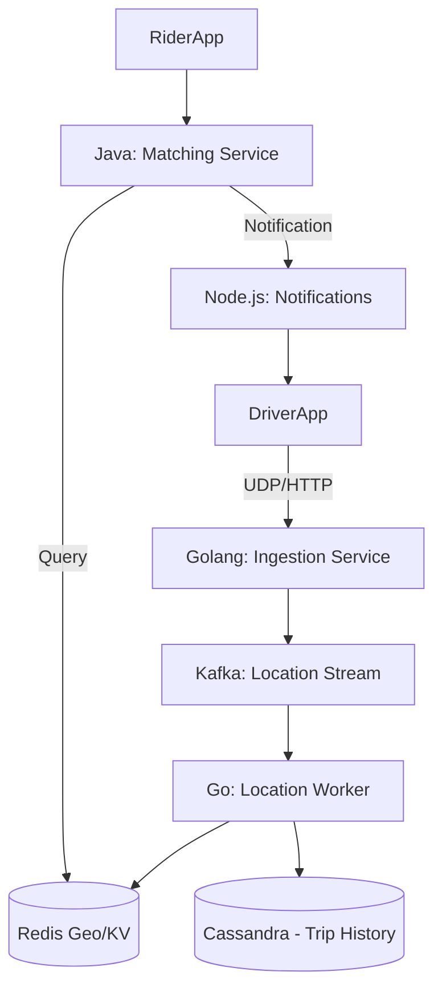
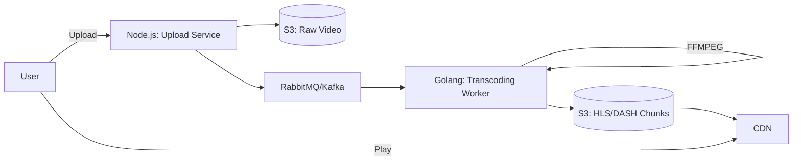

# Practical System Design Interview Solutions

This document provides structured, "interview-style" answers to the practical system design problems. Each solution follows a standard interview flow: restructuring requirements, high-level design, component deep dive, and scalability discussions.

---

## 1. Global E-Commerce Microservices Architecture

**Candidate:** "This is a classic but complex system. I'll break it down into requirements, high-level design, and then deep dive into the specific technologies (Golang, Java, Node, etc.) you mentioned."

### 1. Clarifying Questions & Requirements
*   **Scale:** We are targeting global flash sales, so we need to handle millions of concurrent requests (high availability and consistency are key).
*   **Inventory:** Strict consistency is needed for inventory to prevent overselling.
*   **Latency:** Search and browsing must be extremely fast (< 100ms).

### 2. High-Level Architecture
I proposed a microservices architecture running on Kubernetes.

```mermaid
graph TD
    Client[Web/Mobile Client] --> CDN[CDN (Static Assets)]
    Client --> GlobalLB[Global Load Balancer]
    GlobalLB --> K8s[Kubernetes Cluster]
    
    subgraph "Kubernetes Namespace: E-Commerce"
        Ingress[Ingress Controller / API Gateway]
        
        Ingress --> WebSvc[Node.js: Frontend/BFF]
        Ingress --> SearchSvc[Golang: Search Service]
        Ingress --> OrderSvc[Java: Order Service]
        Ingress --> UserSvc[Node.js: User Service]
        
        SearchSvc --> ES[Elasticsearch]
        OrderSvc --> DB_Order[(PostgreSQL - Sharded)]
        OrderSvc --> Redis_Inv[(Redis - Inventory Cache)]
        UserSvc --> DB_User[(MongoDB)]
        
        OrderSvc -- Async Events --> Kafka[Kafka Message Broker]
        Kafka --> NotifSvc[Notification Worker]
        Kafka --> InventorySvc[Inventory Worker]
    end
```

### 3. Component Deep Dive

**A. Search & Catalog (Golang + Elasticsearch)**
*   **Why Golang?** Search is read-heavy and requires high concurrency. Golang's goroutines are perfect for handling thousands of incoming search queries simultaneously with minimal memory footprint.
*   **Implementation:** The Go service will expose a gRPC API for internal services and REST/GraphQL for the gateway. It caches frequent queries in an in-memory local cache (like Ristretto) or Redis to reduce load on Elasticsearch.

**B. Order Management (Java Spring Boot)**
*   **Why Java?** handling orders involves complex state machines (Created, Pending, Paid, Shipped) and distributed transactions. Java's Spring Boot ecosystem offers robust support for transactions (JPA/Hibernate) and enterprise integration patterns.
*   **Flash Sales:** To handle the spike, we'll use a **Redis-Lua script** to decrement inventory atomically *before* creating the SQL order. If Redis returns "out of stock", we reject the request immediately, saving the DB.

**C. API Gateway (GraphQL)**
*   Instead of making the frontend call 5 different services (User, Product, Cart, etc.), we use a GraphQL layer (Apollo Federation or a simple Node.js aggregator). This solves the "over-fetching" and "under-fetching" problem, serving the UI exactly what it needs.

### 4. Data Flow: "Place Order"
1.  **User** clicks "Buy". Request hits **Node.js Gateway**.
2.  Gateway verifies JWT via **User Service**.
3.  Gateway forwards request to **Java Order Service**.
4.  **Java Service** executes Redis Lua script to checks/reservie inventory.
5.  If success, it writes a "Pending" order to **PostgreSQL**.
6.  It pushes an "OrderCreated" event to **Kafka**.
7.  **Payment Service** (listening to Kafka) processes payment.
8.  On success, it updates Order status to "Confirmed" and triggers **Notification Service** (Node.js) to send an email.

### 5. Scalability & Infrastructure
*   **Kubernetes (HPA):** We configure Horizontal Pod Autoscalers. If CPU usage on the Go Search pods > 60%, K8s spins up new pods automatically.
*   **Database:** PostgreSQL creates read-replicas for catalog viewing. For orders, we might shard by `ProcessingRegion` or `UserID`.

---

## 2. Real-Time Collaborative Code Editor

**Candidate:** "This asks for a system like Google Docs or VS Code Live Share. The core challenge is 'Operational Transformation' (OT) or CRDTs for consistency."

### 1. Core Requirements
*   **Real-time:** Latency must be barely noticeable.
*   **Consistency:** All users must eventually see the same document state.
*   **Offline Support:** Handling reconnections gracefully.

### 2. High-Level Architecture

```mermaid
graph LR
    UserA[User A] -- WebSocket --> LB[Load Balancer]
    UserB[User B] -- WebSocket --> LB
    
    LB --> CollabSvc[Golang: Collab Service (WebSockets)]
    
    CollabSvc --> RedisPubSub[(Redis Pub/Sub)]
    CollabSvc --> DocStore[(Document Store - NoSQL)]
    
    subgraph "Consistency Logic"
    CollabSvc -- OT/CRDT --> Logic[Conflict Resolution]
    end
```

### 3. Component Deep Dive

**A. Collaboration Service (Golang)**
*   **Why Golang?** We need to maintain persistent WebSocket connections for potentially millions of users. Go's net/http and goroutine-per-connection model can handle 100k+ concurrent connections on a single decent server.
*   **Protocol:** We'll use WebSockets. Messages will contain small "deltas" (e.g., "insert 'a' at index 5"), not the whole file.

**B. Conflict Resolution**
*   **Problem:** User A types "X" and User B types "Y" at the same time.
*   **Solution:** We use **Operational Transformation (OT)** (like Google Docs) or **CRDTs (Conflict-free Replicated Data Types)**.
    *   *Implementation:* The Go service acts as the source of truth. It assigns a version number to every change. If User B sends a change based on version 10, but the server is at 11, the server transforms User B's operation against the verified operation 11 before applying it.

### 4. Storage & Persistence (Node.js + S3)
*   While the active session is in memory/Redis, we need to save files.
*   A **Node.js** background worker flushes the in-memory document state to S3 (object storage) every few seconds (snapshotting) or when all users disconnect.

---

## 3. High-Throughput Ride-Share Backend

**Candidate:** "Detailed location tracking and matching are the hard parts here. Let's focus on the 'Geo' aspect."

### 1. Key Requirements
*   **High Write Volume:** Drivers update locations every 3-5 seconds.
*   **Spatial Queries:** "Find nearest 5 drivers to (Lat, Lon)".
*   **Matching:** Assigning the *best* driver, not just the nearest.

### 2. Architecture Diagram



### 3. Component Deep Dive

**A. Location Service (Golang + Redis)**
*   **Why Golang?** Simple, raw performance for handling massive JSON/Protobuf streams.
*   **Storage:** We use **Redis Geospatial indexes** (`GEOADD`, `GEORADIUS`).
    *   *Driver Update:* `GEOADD drivers <lon> <lat> <driver_id>`
    *   *Expiry:* Set a TTL of 10 seconds so inactive drivers "disappear" automatically.

**B. Matching Service (Java)**
*   **Why Java?** The matching algorithm might be complex (considering traffic, driver rating, destination filters). Java is great for this business logic.
*   **Flow:**
    1.  Rider requests ride.
    2.  Java service queries Redis: `GEORADIUS rider_loc 5km ASC`.
    3.  It gets a list of Candidate Drivers.
    4.  It filters/ranks them and sends a request to the top candidate.

### 4. Scalability
*   **Sharding:** We shard the world using **S2 Geometry** (Google's library) or Geohashes. We can have dedicated Kafka partitions and Redis clusters for "New York", "London", etc.

---

## 4. Video Streaming Platform

**Candidate:** "This requires handling massive binary data and ensuring smooth playback via adaptive streaming."

### 1. High-Level Design for Upload & Transcoding



### 2. Component Deep Dive

**A. Upload Service (Node.js)**
*   **Why Node?** Node's non-blocking I/O is excellent for handling file streams. We can pipe the incoming request stream directly to S3 (Multipart upload) without holding the whole file in RAM.

**B. Transcoding (Golang + FFmpeg)**
*   **Why Golang?** We need to wrap OS-level processes (FFmpeg). Go does this well (`os/exec`).
*   **Adaptive Bitrate (ABR):** We convert the raw video into 360p, 720p, and 1080p chunks (.ts files) and a manifest (.m3u8). This allows the player to switch quality based on bandwidth.

**C. Scalability**
*   **Queue-Based Scaling:** We use a **Kubernetes KEDA** scaler. It monitors the RabbitMQ queue length.
    *   *Queue Empty:* 2 workers running.
    *   *User uploads 100 videos:* Queue spikes. KEDA scales deployments to 50 pods.
    *   *Finished:* KEDA scales back down to 2.

---

## 5. Distributed Task Scheduler

**Candidate:** "Building a distributed cron is tough because of the 'double execution' problem."

### 1. Architecture

*   **API Server (Node.js):** Accepts `POST /schedule { cron: "* * * * *", url: "..." }`. Stores in PostgreSQL.
*   **Scheduler (Golang):** The "Brain".
*   **Executor (Java/Go):** The "Muscle".

### 2. The Core Mechanism (Golang)
*   **Partitioning:** We divide time into "ticks" (e.g., 1 minute).
*   **Leader Election:** We run 3 instances of the Scheduler. We use **Etcd** (or a DB lock) to elect a Leader. Only the Leader reads upcoming jobs from the DB.
*   **Dispatching:**
    1.  Leader wakes up every minute.
    2.  Queries DB: `SELECT * FROM jobs WHERE next_run <= now()`.
    3.  Pushes these job IDs to a Kafka topic.

**A. Executors**
*   Worker pods (Java/Go) listen to Kafka.
*   They execute the task (e.g., call a webhook, flush a cache).
*   **Idempotency:** The worker MUST handle the case where a job is delivered twice.

---

## 6. Social Media News Feed

**Candidate:** "The challenge is 'Fan-out'. Do we push posts to all followers (Write-heavy) or pull them when viewing (Read-heavy)?"

### 1. Strategy: Hybrid approach

*   **Celebrities (Justin Bieber):** **Pull Model**. We don't write to 100M timelines. Users fetch his posts when they load the feed.
*   **Normal Users:** **Push Model**. When I post, it's immediately written to my 200 followers' pre-computed feed caches.

### 2. Data Flow
1.  **Post Service (Node.js):** Accepts the post. Saves to Cassidy/DB.
2.  **Fan-Out Service (Java):**
    *   Fetches author's followers from **GraphDB** (or Go Graph Service).
    *   If followers < 5k: Pushes PostID to everyone's Redis List ("Timeline").
    *   If followers > 5k: Marks post as "Hot".
3.  **Feed Retrieval (Golang + Redis):**
    *   User opens app.
    *   Service reads their Redis List (pre-computed normal posts).
    *   Service queries "Hot" posts from celebrities they follow.
    *   Merges the lists by timestamp and returns JSON.

### 3. Technologies
*   **Redis:** Crucial for storing the "Timeline" lists (`LPUSH`, `LRANGE`).
*   **GraphDB:** Essential for efficiently querying "Who follows User X?".
