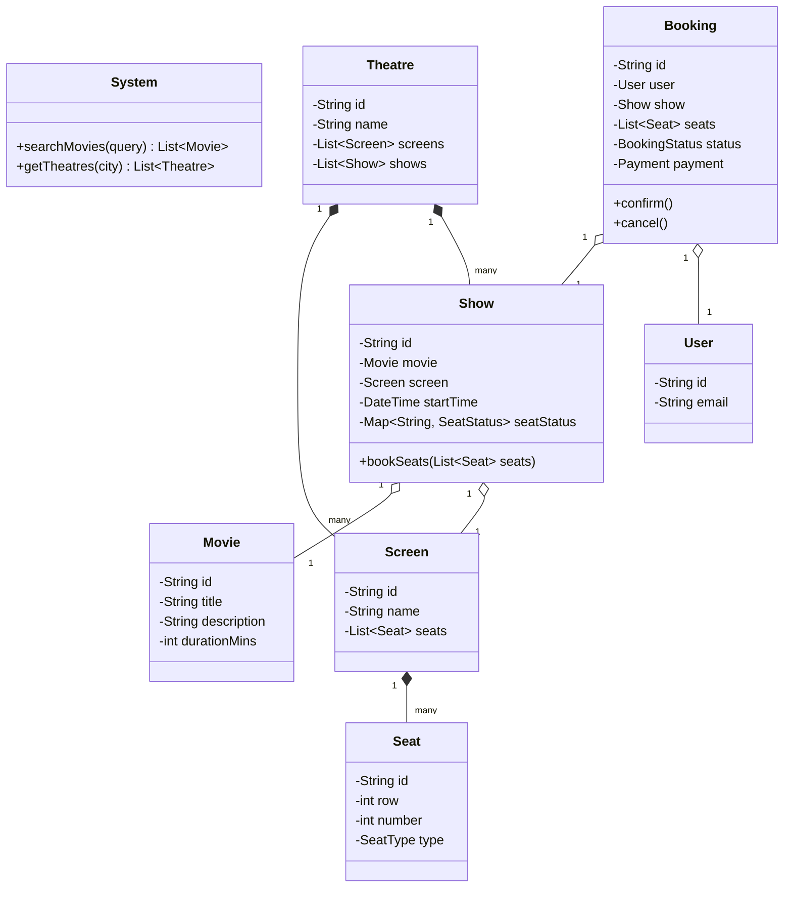

# Design a Movie Ticket Booking System

## Problem Statement
Design an online movie ticket booking system like BookMyShow or Fandango. The system should allow users to search for movies, select a theatre and showtime, choose seats, and make payments.

## Application Requirements

### Functional Requirements
1.  **Search**: Users can search movies by city, genre, or language.
2.  **Theatres & Shows**: Each city has multiple theatres. Each theatre has multiple screens. Each screen plays a movie at specific showtimes.
3.  **Seat Selection**: Users can select specific seats (e.g., A1, A2) which are locked during the booking process.
4.  **Booking**: A booking is confirmed only after successful payment.
5.  **Concurrency**: Multiple users might try to book the same seat simultaneously.

### Non-Functional Requirements
1.  **High Concurrency**: The system must handle high traffic during new movie releases.
2.  **ACID Properties**: Booking transactions must be atomic.
3.  **Latency**: Seat locking and booking confirmation should be low latency.

## Class Diagram (Mermaid)



## Go Implementation (Concurrency Focus)

```go
package main

import (
	"errors"
	"fmt"
	"sync"
	"time"
)

type SeatStatus int

const (
	SeatAvailable SeatStatus = iota
	SeatLocked
	SeatBooked
)

type Seat struct {
	ID  string
	Row int
	Num int
}

type Show struct {
	ID        string
	MovieID   string
	SeatLocks map[string]SeatStatus // In-memory map for demo (Use Redis in prod)
	Lock      sync.RWMutex          // Mutex for thread safety
}

// NewShow creates a show with standard 100 seats
func NewShow(id, movieID string) *Show {
	s := &Show{
		ID:        id,
		MovieID:   movieID,
		SeatLocks: make(map[string]SeatStatus),
	}
	// Init 100 seats as Available
	for i := 1; i <= 100; i++ {
		seatID := fmt.Sprintf("S%d", i)
		s.SeatLocks[seatID] = SeatAvailable
	}
	return s
}

// BookSeats attempts to lock seats for a user
// Returns error if any seat is already locked/booked
func (s *Show) BookSeats(seatIDs []string) error {
	s.Lock.Lock() // Critical Section Start
	defer s.Lock.Unlock()

	// 1. Check Availability
	for _, id := range seatIDs {
		status, exists := s.SeatLocks[id]
		if !exists || status != SeatAvailable {
			return fmt.Errorf("seat %s is not available", id)
		}
	}

	// 2. Lock Seats (Optimistic Locking or just simple mutex for single instance)
	for _, id := range seatIDs {
		s.SeatLocks[id] = SeatLocked
	}
	
	// In real world, we would start a timer here to release lock if payment fails
	fmt.Printf("Seats %v locked. Proceed to payment...\n", seatIDs)
	return nil
}

// ConfirmBooking makes the lock permanent
func (s *Show) ConfirmBooking(seatIDs []string) {
	s.Lock.Lock()
	defer s.Lock.Unlock()
	
	for _, id := range seatIDs {
		s.SeatLocks[id] = SeatBooked
	}
	fmt.Printf("Seats %v confirmed!\n", seatIDs)
}

func main() {
	show := NewShow("SHOW-1", "AVENGERS")

	// Simulate 2 users trying to book same seat concurrently
	var wg sync.WaitGroup
	wg.Add(2)

	// User 1
	go func() {
		defer wg.Done()
		seats := []string{"S5", "S6"}
		err := show.BookSeats(seats)
		if err != nil {
			fmt.Printf("User 1 failed: %v\n", err)
		} else {
			fmt.Println("User 1 locked seats. Confirming...")
			time.Sleep(100 * time.Millisecond) // Simulate payment time
			show.ConfirmBooking(seats)
		}
	}()

	// User 2 (Tries S6 which User 1 takes)
	go func() {
		defer wg.Done()
		time.Sleep(10 * time.Millisecond) // Ensure User 1 starts first
		seats := []string{"S6", "S7"}
		err := show.BookSeats(seats)
		if err != nil {
			fmt.Printf("User 2 failed: %v\n", err)
		} else {
			fmt.Println("User 2 locked seats.")
			show.ConfirmBooking(seats)
		}
	}()

	wg.Wait()
	
	// Check final status
	show.Lock.RLock()
	fmt.Printf("Final status of S6: %v (2=Booked)\n", show.SeatLocks["S6"])
	show.Lock.RUnlock()
}
```

## Key Evaluation Points
1.  **Handling Race Conditions**: Specifically solving the "Double Booking" problem using Mutex (or transactions/Redis in distributed systems).
2.  **State Management**: `Available` -> `Locked` -> `Booked` lifecycle.
3.  **Data Modeling**: The relationship between `Theatre`, `Screen`, and `Show` is crucial. A `Screen` has physical seats, but a `Show` is an instance of a movie on that screen with its own *availability* map.

