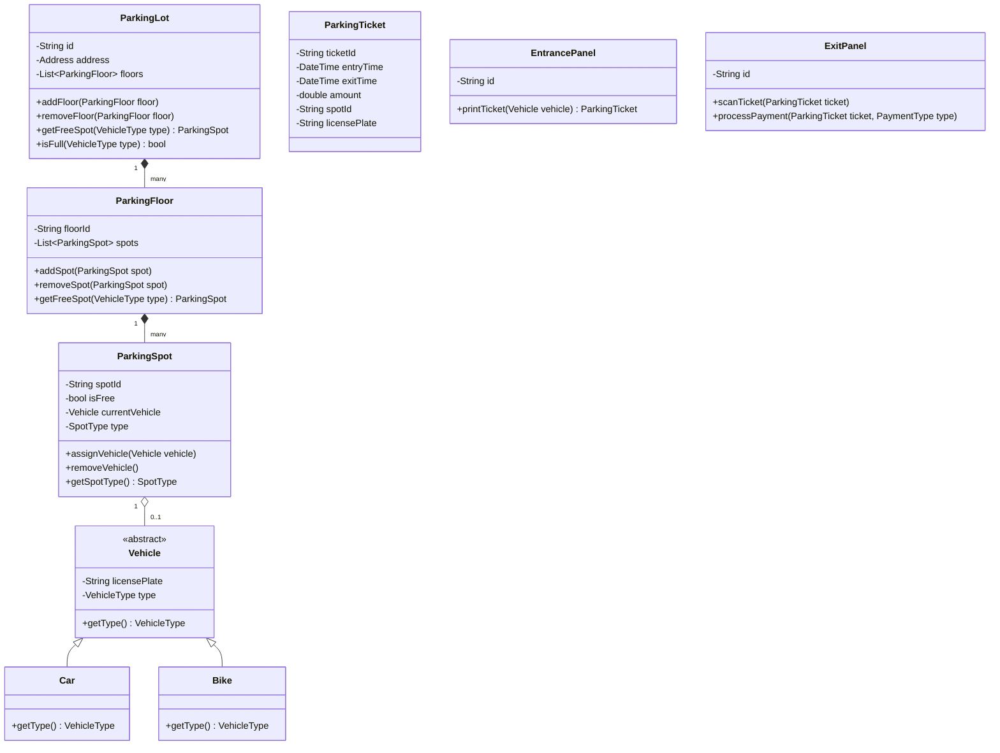

# Design a Parking Lot

## Problem Statement
Design a Low-Level Design (LLD) for a parking lot system. The system should manage parking spots for different vehicle types, handle entry and exit of vehicles, calculate parking fees, and support multiple floors.

## Application Requirements

### Functional Requirements
1.  **Multiple Levels**: The parking lot should have multiple floors or levels.
2.  **Vehicle Types**: Support different types of vehicles (Car, Bike, Truck).
3.  **Spot Types**: Each floor can have different types of spots (Compact, Large, Handicapped, Motorcycle).
4.  **Entry/Exit**: The system must have multiple entry and exit panels.
5.  **Parking Ticket**: A ticket is issued at the entry with a timestamp.
6.  **Payment**: Guests pay at the exit or a payment kiosk. Payment is calculated based on duration and vehicle type.
7.  **Capacity**: The system should track available spots and show "Full" if no spots are available.

### Non-Functional Requirements
1.  **Concurrency**: Should handle multiple vehicles entering/exiting simultaneously.
2.  **Extensibility**: Should be easy to add new vehicle or spot types.
3.  **Consistency**: Spot allocation must be consistent (no two vehicles in the same spot).

## Class Diagram (Mermaid)



## Go Implementation

```go
package main

import (
	"errors"
	"fmt"
	"sync"
	"time"
)

// Enums for Vehicle and Spot types
type VehicleType int
type SpotType int

const (
	VehicleTypeBike VehicleType = iota
	VehicleTypeCar
	VehicleTypeTruck
)

const (
	SpotTypeMotorcycle SpotType = iota
	SpotTypeCompact
	SpotTypeLarge
)

// Vehicle Interface
type Vehicle interface {
	GetType() VehicleType
	GetLicensePlate() string
}

type Car struct {
	LicensePlate string
}

func (c *Car) GetType() VehicleType {
	return VehicleTypeCar
}

func (c *Car) GetLicensePlate() string {
	return c.LicensePlate
}

// ParkingSpot
type ParkingSpot struct {
	ID       string
	Type     SpotType
	IsFree   bool
	Vehicle  Vehicle
	Lock     sync.Mutex
}

func (ps *ParkingSpot) AssignVehicle(v Vehicle) error {
	ps.Lock.Lock()
	defer ps.Lock.Unlock()
	if !ps.IsFree {
		return errors.New("spot is already occupied")
	}
	ps.Vehicle = v
	ps.IsFree = false
	return nil
}

func (ps *ParkingSpot) RemoveVehicle() {
	ps.Lock.Lock()
	defer ps.Lock.Unlock()
	ps.Vehicle = nil
	ps.IsFree = true
}

// ParkingFloor
type ParkingFloor struct {
	ID    string
	Spots []*ParkingSpot
}

func (pf *ParkingFloor) GetFreeSpot(vType VehicleType) *ParkingSpot {
	// Simple strategy: First available spot that fits
	// In real app, map vehicle type to spot type (e.g. Car -> Compact)
	for _, spot := range pf.Spots {
		if spot.IsFree && canPark(spot.Type, vType) {
			return spot
		}
	}
	return nil
}

func canPark(sType SpotType, vType VehicleType) bool {
	if sType == SpotTypeLarge {
		return true // Large fits everything
	}
	if sType == SpotTypeCompact && (vType == VehicleTypeCar || vType == VehicleTypeBike) {
		return true
	}
	if sType == SpotTypeMotorcycle && vType == VehicleTypeBike {
		return true
	}
	return false
}

// ParkingLot (Singleton Pattern often used here, but struct for simplicity)
type ParkingLot struct {
	Floors []*ParkingFloor
}

func (pl *ParkingLot) FindSpot(v Vehicle) *ParkingSpot {
	for _, floor := range pl.Floors {
		if spot := floor.GetFreeSpot(v.GetType()); spot != nil {
			return spot
		}
	}
	return nil
}

// Ticket
type Ticket struct {
	ID        string
	EntryTime time.Time
	SpotID    string
	Plate     string
}

// EntryPanel
type EntryPanel struct {
	ID string
	PL *ParkingLot
}

func (ep *EntryPanel) GenerateTicket(v Vehicle) (*Ticket, error) {
	spot := ep.PL.FindSpot(v)
	if spot == nil {
		return nil, errors.New("parking lot full")
	}

	if err := spot.AssignVehicle(v); err != nil {
		return nil, err // Race condition caught
	}

	return &Ticket{
		ID:        fmt.Sprintf("TKT-%d", time.Now().UnixNano()),
		EntryTime: time.Now(),
		SpotID:    spot.ID,
		Plate:     v.GetLicensePlate(),
	}, nil
}

func main() {
	// Setup
	spot1 := &ParkingSpot{ID: "1-1", Type: SpotTypeCompact, IsFree: true}
	spot2 := &ParkingSpot{ID: "1-2", Type: SpotTypeLarge, IsFree: true}
	floor1 := &ParkingFloor{ID: "F1", Spots: []*ParkingSpot{spot1, spot2}}
	lot := &ParkingLot{Floors: []*ParkingFloor{floor1}}
	entryPanel := &EntryPanel{ID: "E1", PL: lot}

	// Simulation
	car := &Car{LicensePlate: "ABC-123"}
	ticket, err := entryPanel.GenerateTicket(car)
	if err != nil {
		fmt.Println("Error:", err)
	} else {
		fmt.Printf("Ticket Issued: %+v\n", ticket)
		fmt.Printf("Parked at: %s\n", ticket.SpotID)
	}
}
```

## Key Evaluation Points
1.  **Usage of Interfaces**: `Vehicle` interface allows easy addition of new types.
2.  **Concurrency**: Note the use of `sync.Mutex` in `ParkingSpot` to prevent double booking.
3.  **Separation of Concerns**: `EntryPanel` handles ticketing, `ParkingLot` handles spot management.
4.  **Extensibility**: Adding a `ElectricCar` is just a new struct and `VehicleType` constant.

