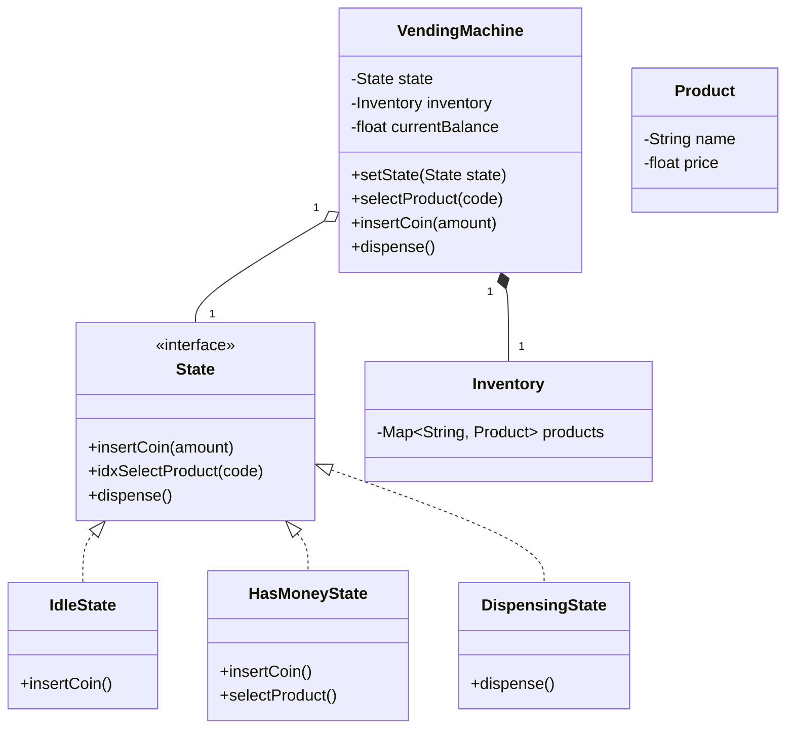

# Design a Vending Machine

## Problem Statement
Design a Vending Machine that dispenses products based on user selection and payment. The machine accepts coins and notes, allows selecting a product, dispenses the product if sufficient balance exists, and returns change.

## Application Requirements

### Functional Requirements
1.  **Inventory**: The machine stores products in specific slots.
2.  **Money**: Accepts coins (1, 5, 10, 25) and notes.
3.  **Selection**: User selects a product using a code (e.g., A1, B2).
4.  **State Management**: The machine transitions through states (Idle -> Money Inserted -> Selection Made -> Dispensing -> Change Returned).
5.  **Refund**: User can cancel transaction and get a full refund before product is dispensed.
6.  **Reset**: Admin can restock items and collect money.

## Design Pattern
The **State Design Pattern** is the most standard approach for this problem because the machine's behavior changes based on its internal state.

## Class Diagram (Mermaid)



## Go Implementation (State Pattern)

```go
package main

import (
	"fmt"
)

// ---------------- State Interface ----------------
type State interface {
	InsertMoney(amount int) error
	SelectProduct(code string) error
	DispenseProduct() error
}

// ---------------- Vending Machine ----------------
type VendingMachine struct {
	hasMoneyState  State
	idleState      State
	dispensingState State

	currentState State

	currentBalance int
	inventory      map[string]*Product
}

type Product struct {
	Name  string
	Price int
	Count int
}

func NewVendingMachine() *VendingMachine {
	vm := &VendingMachine{
		inventory: make(map[string]*Product),
	}
	vm.hasMoneyState = &HasMoneyState{vm: vm}
	vm.idleState = &IdleState{vm: vm}
	vm.dispensingState = &DispensingState{vm: vm}

	vm.currentState = vm.idleState
	return vm
}

func (vm *VendingMachine) AddProduct(code string, p *Product) {
	vm.inventory[code] = p
}

func (vm *VendingMachine) SetState(s State) {
	vm.currentState = s
}

// Delegate actions to current state
func (vm *VendingMachine) InsertMoney(amount int) error {
	return vm.currentState.InsertMoney(amount)
}

func (vm *VendingMachine) SelectProduct(code string) error {
	return vm.currentState.SelectProduct(code)
}

func (vm *VendingMachine) DispenseProduct() error {
	return vm.currentState.DispenseProduct()
}

// ---------------- IDLE STATE ----------------
type IdleState struct {
	vm *VendingMachine
}

func (s *IdleState) InsertMoney(amount int) error {
	s.vm.currentBalance += amount
	fmt.Printf("Money inserted: %d. Total: %d\n", amount, s.vm.currentBalance)
	s.vm.SetState(s.vm.hasMoneyState)
	return nil
}

func (s *IdleState) SelectProduct(code string) error {
	return fmt.Errorf("please insert money first")
}

func (s *IdleState) DispenseProduct() error {
	return fmt.Errorf("payment required")
}

// ---------------- HAS MONEY STATE ----------------
type HasMoneyState struct {
	vm *VendingMachine
}

func (s *HasMoneyState) InsertMoney(amount int) error {
	s.vm.currentBalance += amount
	fmt.Printf("Money inserted: %d. Total: %d\n", amount, s.vm.currentBalance)
	return nil
}

func (s *HasMoneyState) SelectProduct(code string) error {
	product, exists := s.vm.inventory[code]
	if !exists {
		return fmt.Errorf("invalid product code")
	}
	if product.Count <= 0 {
		return fmt.Errorf("product out of stock")
	}
	if s.vm.currentBalance < product.Price {
		return fmt.Errorf("insufficient funds. Need %d more", product.Price-s.vm.currentBalance)
	}

	fmt.Printf("Product selected: %s\n", product.Name)
	s.vm.SetState(s.vm.dispensingState)
	// Auto Trigger Dispense in this simplified flow
	return s.vm.DispenseProduct()
}

func (s *HasMoneyState) DispenseProduct() error {
	return fmt.Errorf("please select product first")
}

// ---------------- DISPENSING STATE ----------------
type DispensingState struct {
	vm *VendingMachine
}

func (s *DispensingState) InsertMoney(amount int) error {
	return fmt.Errorf("wait! dispensing product")
}

func (s *DispensingState) SelectProduct(code string) error {
	return fmt.Errorf("already dispensing")
}

func (s *DispensingState) DispenseProduct() error {
	fmt.Println("Dispensing product...")
	// Logic to physically dispense + reduce inventory
	// s.vm.inventory[code].Count-- (Simplified: assume we tracking which code was selected context)
	
	change := s.vm.currentBalance // Simplified: taking all money logic for now
	// In real app we deduct price.
	
	s.vm.currentBalance = 0
	s.vm.SetState(s.vm.idleState)
	fmt.Printf("Please collect product and change: %d\n", change)
	return nil
}

func main() {
	vm := NewVendingMachine()
	vm.AddProduct("A1", &Product{Name: "Coke", Price: 10, Count: 5})

	fmt.Println("--- Scenario 1: Success ---")
	vm.InsertMoney(5)
	vm.InsertMoney(5)
	vm.SelectProduct("A1")

	fmt.Println("\n--- Scenario 2: No Money ---")
	vm.SelectProduct("A1")
}
```

## Key Evaluation Points
1.  **State Pattern**: This is the classic textbook example for State Pattern. Do not use `if-else` blocks for state management.
2.  **Extensibility**: Adding a new state (e.g., `MaintenanceState`) is easy without modifying existing states.
3.  **Encapsulation**: Each state manages what is allowed. For example, you cannot `SelectProduct` in `DispensingState`.
