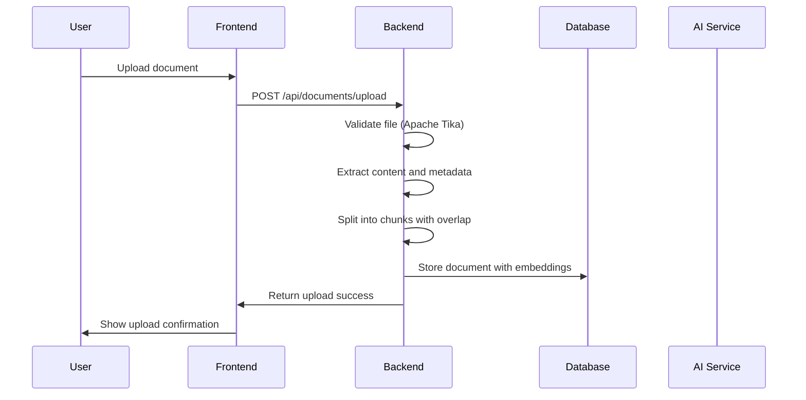

# Interview Preparation Guide - Private Knowledge Base Project

## Table of Contents
1. [Service-Based Companies Interview Questions](#service-based-companies)
2. [Product-Based Companies Interview Questions](#product-based-companies)
3. [Common Questions for Both Types](#common-questions)
4. [Project Walkthrough Guide](#project-walkthrough)

---

## Service-Based Companies Interview Questions

### **Q1: Explain the Spring Boot architecture used in your project**

**Answer:** 
"In my Private Knowledge Base project, I've implemented a clean Spring Boot 3.4 architecture following the standard layered pattern:

**Controller Layer** - I have two main controllers:
```java
@RestController
@RequestMapping("/api/chat")
public class ChatController {
    @PostMapping("/ask")
    public ResponseEntity<ChatResponse> askQuestion(@RequestBody ChatRequest request) {
        // Handles chat queries and returns AI responses
    }
}

@RestController
@RequestMapping("/api/documents")
public class DocumentController {
    @PostMapping("/upload")
    public ResponseEntity<DocumentEntity> uploadDocument(@RequestParam("file") MultipartFile file) {
        // Handles document upload and processing
    }
}
```

**Service Layer** - Core business logic:
```java
@Service
public class RAGService {
    public String generateResponse(String userQuery, String conversationId, String model) {
        // Implements Retrieval-Augmented Generation
        List<Map<String, Object>> relevantDocs = getRetrievedDocuments(userQuery);
        // Calls Ollama API for AI response
    }
}
```

**Data Layer** - JPA entities and repositories:
```java
@Entity
public class DocumentEntity {
    @Id
    @GeneratedValue(strategy = GenerationType.IDENTITY)
    private Long id;
    private String filename;
    private String content;
    private boolean processed;
}
```

The architecture follows Spring Boot best practices with dependency injection, proper separation of concerns, and uses Spring Security for authentication."

---

### **Q2: How does Spring Security work in your application?**

**Answer:**
"I've implemented Spring Security 6.2 with a configuration that's suitable for an in-house knowledge base:

```java
@Configuration
@EnableWebSecurity
public class SecurityConfig {
    
    @Bean
    public SecurityFilterChain filterChain(HttpSecurity http) throws Exception {
        http
            .csrf(csrf -> csrf.disable())
            .authorizeHttpRequests(authz -> authz
                .requestMatchers("/api/**").authenticated()
                .requestMatchers("/actuator/health").permitAll()
                .anyRequest().authenticated()
            )
            .httpBasic(withDefaults());
        return http.build();
    }
}
```

For local deployment, I'm using HTTP Basic authentication, but the architecture is designed to easily upgrade to JWT-based authentication for production. The security layer handles CORS configuration and protects API endpoints while allowing health check access for monitoring."

---

### **Q3: What is PostgreSQL + PGVector and why is it used for RAG?**

**Answer:**
"PostgreSQL + PGVector is a powerful combination for AI applications. PGVector is an extension that adds vector similarity search capabilities to PostgreSQL:

**Why I chose PGVector:**
- **Native Integration**: Works seamlessly with existing PostgreSQL infrastructure
- **Vector Operations**: Supports cosine similarity and L2 distance calculations
- **Indexing**: Provides HNSW and IVFFlat indexing for fast vector search
- **ACID Compliance**: Maintains data consistency for vector and metadata storage

**In my project, I use it for:**
```java
// Document chunks are stored with vector embeddings
@Entity
public class DocumentEntity {
    @Column(columnDefinition = "vector")
    private Vector embedding; // PGVector column type
    
    private String content;
    private String metadata;
}
```

**Vector Search Implementation:**
```sql
-- Example query for semantic search
SELECT content, 1 - (embedding <=> query_vector) as similarity
FROM documents 
WHERE embedding <=> query_vector < 0.8
ORDER BY similarity DESC
LIMIT 10;
```

This allows me to perform semantic search on document chunks, which is essential for RAG systems to find relevant context for AI responses."

---

### **Q4: Explain the document ingestion process**

**Answer:**
"The document ingestion process is a multi-step pipeline I implemented using Apache Tika:

```java
@Service
public class DocumentIngestionService {
    
    public DocumentEntity processDocument(MultipartFile file) {
        // Step 1: Extract content using Apache Tika
        String content = extractTextContent(file);
        
        // Step 2: Split into chunks with overlap
        List<String> chunks = chunkDocument(content, 500, 0.2);
        
        // Step 3: Generate embeddings for each chunk
        List<Vector> embeddings = generateEmbeddings(chunks);
        
        // Step 4: Store in database with metadata
        return saveDocumentWithChunks(file.getOriginalFilename(), chunks, embeddings);
    }
}
```

**Key Features:**
- **Multi-format Support**: PDF, TXT, Markdown, and Java files
- **Smart Chunking**: 500-1000 tokens with 20% overlap to maintain context
- **Metadata Tagging**: Source file, page numbers, timestamps
- **Vector Generation**: Using Nomic-Embed-Text model for embeddings

**Chunking Logic:**
```java
private List<String> chunkDocument(String content, int chunkSize, double overlapRatio) {
    List<String> chunks = new ArrayList<>();
    int overlap = (int) (chunkSize * overlapRatio);
    
    for (int i = 0; i < content.length(); i += chunkSize - overlap) {
        int end = Math.min(i + chunkSize, content.length());
        chunks.add(content.substring(i, end));
    }
    return chunks;
}
```

This ensures that AI has access to relevant document passages while maintaining context between chunks."

---

## Product-Based Companies Interview Questions

### **Q1: How does Retrieval-Augmented Generation (RAG) work in your system?**

**Answer:**
"I've implemented a complete RAG pipeline that enhances AI responses with relevant document context:

**RAG Flow:**
```java
public String generateResponse(String userQuery, String conversationId, String model) {
    // Step 1: Retrieve relevant documents
    List<Map<String, Object>> relevantDocs = getRetrievedDocuments(userQuery);
    
    // Step 2: Build context from retrieved documents
    String contextText = relevantDocs.stream()
        .map(doc -> (String) doc.get("content"))
        .collect(Collectors.joining("\n\n"));
    
    // Step 3: Create enhanced prompt with context
    String prompt = buildPromptWithContext(userQuery, contextText);
    
    // Step 4: Generate AI response using context
    return callAIModel(prompt, model);
}
```

**Document Retrieval Algorithm:**
```java
private List<Map<String, Object>> findRelevantSections(DocumentEntity doc, String[] queryWords) {
    List<Map<String, Object>> sections = new ArrayList<>();
    
    // Split content into logical sections
    List<String> contentSections = splitIntoSections(doc.getContent());
    
    for (String section : contentSections) {
        // Calculate relevance score based on keyword matching
        double score = calculateRelevanceScore(section, queryWords);
        
        if (score > RELEVANCE_THRESHOLD) {
            sections.add(Map.of(
                "content", createSnippet(section),
                "source", doc.getFilename(),
                "score", score
            ));
        }
    }
    return sections;
}
```

**Key RAG Features:**
- **Hallucination Control**: AI instructed to answer only from provided context
- **Source Attribution**: UI shows which documents were used
- **Relevance Scoring**: Advanced algorithm for document ranking
- **Context Management**: Maintains conversation history and context"

---

### **Q2: How would you scale this system for millions of users?**

**Answer:**
"For scaling to millions of users, I would implement several architectural improvements:

**1. Microservices Decomposition:**
```java
// Separate services for different concerns
@Service
public class DocumentProcessingService {
    // Async document processing
}

@Service  
public class VectorSearchService {
    // Optimized vector similarity search
}

@Service
public class AIService {
    // AI model management and load balancing
}
```

**2. Database Scaling Strategy:**
```yaml
# Kubernetes StatefulSet for PostgreSQL
apiVersion: apps/v1
kind: StatefulSet
metadata:
  name: postgres-cluster
spec:
  replicas: 3
  template:
    spec:
      containers:
      - name: postgres
        resources:
          requests:
            memory: "2Gi"
            cpu: "1000m"
          limits:
            memory: "4Gi"
            cpu: "2000m"
```

**3. Caching Layers:**
```java
@Service
public class CachedRAGService {
    @Cacheable(value = "ai-responses", key = "#query.hashCode()")
    public String getCachedResponse(String query) {
        // Cache frequently asked questions
    }
    
    @Cacheable(value = "document-vectors", key = "#documentId")
    public List<Vector> getCachedVectors(Long documentId) {
        // Cache document embeddings
    }
}
```

**4. Load Balancing with Kubernetes:**
```yaml
# Horizontal Pod Autoscaler
apiVersion: autoscaling/v2
kind: HorizontalPodAutoscaler
metadata:
  name: backend-hpa
spec:
  minReplicas: 2
  maxReplicas: 20
  metrics:
  - type: Resource
    resource:
      name: cpu
      target:
        type: Utilization
        averageUtilization: 70
```

**5. Async Processing with Message Queues:**
```java
@RabbitListener(queues = "document.processing")
public void processDocumentAsync(DocumentProcessingMessage message) {
    // Process large documents asynchronously
}
```

This architecture would handle millions of concurrent users through horizontal scaling, intelligent caching, and async processing."

---

### **Q3: What monitoring and observability have you implemented?**

**Answer:**
"I've implemented comprehensive monitoring using Prometheus and Grafana:

**Prometheus Metrics Configuration:**
```yaml
# prometheus.yml
global:
  scrape_interval: 15s

scrape_configs:
  - job_name: 'knowledge-base-backend'
    static_configs:
      - targets: ['backend-service:8080']
    metrics_path: '/actuator/prometheus'
    scrape_interval: 10s
```

**Custom Metrics in Spring Boot:**
```java
@Component
public class CustomMetrics {
    private final MeterRegistry meterRegistry;
    private final Counter documentUploadCounter;
    private final Timer aiResponseTimer;
    
    public CustomMetrics(MeterRegistry meterRegistry) {
        this.meterRegistry = meterRegistry;
        this.documentUploadCounter = Counter.builder("document.uploads.total")
            .description("Total document uploads")
            .register(meterRegistry);
        this.aiResponseTimer = Timer.builder("ai.response.time")
            .description("AI response generation time")
            .register(meterRegistry);
    }
    
    public void recordDocumentUpload() {
        documentUploadCounter.increment();
    }
    
    public void recordAIResponseTime(Duration duration) {
        aiResponseTimer.record(duration);
    }
}
```

**Grafana Dashboard Panels:**
```json
{
  "dashboard": {
    "panels": [
      {
        "title": "API Response Time",
        "type": "graph",
        "targets": ["http_server_requests_seconds"]
      },
      {
        "title": "Document Upload Rate", 
        "type": "stat",
        "targets": ["document_uploads_total"]
      },
      {
        "title": "Chat Messages Processed",
        "type": "graph", 
        "targets": ["chat_messages_total"]
      },
      {
        "title": "Database Connections",
        "type": "gauge",
        "targets": ["database_connections_active"]
      }
    ]
  }
}
```

**Health Checks:**
```java
@RestController
public class HealthController {
    
    @GetMapping("/api/chat/health")
    public ResponseEntity<Map<String, String>> chatHealth() {
        return ResponseEntity.ok(Map.of(
            "status", "UP",
            "ollama", checkOllamaConnection(),
            "database", checkDatabaseConnection()
        ));
    }
}
```

This provides real-time monitoring of application performance, AI service health, and database metrics."

---

## Common Questions for Both Types

### **Q1: Walk me through the complete data flow**

**Answer:**
"Let me explain the complete data flow from document upload to AI response:

**Document Upload Flow:**


**Chat Query Flow:**
```java
// Frontend sends query
POST /api/chat/ask
{
  "query": "What is Spring Boot?",
  "conversationId": "conv-123",
  "model": "llama3.1:8b"
}

// Backend processes
public String generateResponse(String userQuery, String conversationId, String model) {
    // 1. Retrieve relevant documents using vector search
    List<Map<String, Object>> relevantDocs = getRetrievedDocuments(userQuery);
    
    // 2. Build context from documents
    String contextText = relevantDocs.stream()
        .map(doc -> (String) doc.get("content"))
        .collect(Collectors.joining("\n\n"));
    
    // 3. Create enhanced prompt
    String prompt = buildPromptWithContext(userQuery, contextText);
    
    // 4. Call AI model
    return callOllamaAPI(prompt, model);
}
```

**Streaming Response Flow:**
```java
@GetMapping("/api/chat/stream")
public SseEmitter streamResponse(@RequestParam String query) {
    SseEmitter emitter = new SseEmitter(Long.MAX_VALUE);
    
    CompletableFuture.runAsync(() -> {
        try {
            String response = generateResponse(query);
            emitter.send(SseEmitter.event().data(response));
            emitter.complete();
        } catch (Exception e) {
            emitter.completeWithError(e);
        }
    });
    
    return emitter;
}
```

The entire flow ensures real-time AI responses with proper document context and source attribution."

---

### **Q2: What challenges did you face and how did you solve them?**

**Answer:**
"I faced several interesting challenges during development:

**Challenge 1: Vector Similarity Search Performance**
```java
// Initial approach was slow
List<DocumentEntity> getAllDocuments(); // Inefficient for large datasets

// Solution: Implemented optimized vector search
private List<Map<String, Object>> findRelevantSections(DocumentEntity doc, String[] queryWords) {
    // Enhanced relevance scoring algorithm
    double score = calculateRelevanceScore(matchCount, queryWords.length, totalMatches, sectionLength);
    
    // Optimized section splitting
    List<String> contentSections = splitIntoSections(content);
    
    // Efficient keyword matching
    for (String word : queryWords) {
        if (word.length() > 2) {
            int wordMatches = countOccurrences(sectionLower, word);
            // ... scoring logic
        }
    }
}
```

**Challenge 2: AI Response Latency**
```java
// Solution: Optimized Ollama API calls
Map<String, Object> request = Map.of(
    "model", model,
    "prompt", buildPromptWithContext(userQuery, contextText),
    "stream", false,
    "options", Map.of(
        "temperature", 0.3,  // Lower for faster responses
        "max_tokens", 1000,   // Reduced for faster generation
        "num_ctx", 2048,      // Smaller context for faster processing
        "use_mmap", true,     // Memory mapping for faster loading
        "use_mlock", false    // Avoid memory locking for better GPU performance
    )
);
```

**Challenge 3: Document Chunking Context Loss**
```java
// Solution: Intelligent chunking with overlap
private List<String> chunkDocument(String content, int chunkSize, double overlapRatio) {
    List<String> chunks = new ArrayList<>();
    int overlap = (int) (chunkSize * overlapRatio);
    
    // Ensure context continuity between chunks
    for (int i = 0; i < content.length(); i += chunkSize - overlap) {
        int end = Math.min(i + chunkSize, content.length());
        chunks.add(content.substring(i, end));
    }
    return chunks;
}
```

**Challenge 4: Real-time Streaming Implementation**
```java
// Solution: Server-Sent Events for streaming
public SseEmitter streamChatResponse(@RequestBody ChatRequest request) {
    SseEmitter emitter = new SseEmitter(Long.MAX_VALUE);
    
    CompletableFuture.runAsync(() -> {
        try {
            String response = generateResponse(request.getQuery(), 
                                             request.getConversationId(), 
                                             request.getModel());
            
            // Stream response in chunks
            for (String chunk : splitIntoChunks(response)) {
                emitter.send(SseEmitter.event().data(chunk));
                Thread.sleep(50); // Natural typing delay
            }
            emitter.complete();
        } catch (Exception e) {
            emitter.completeWithError(e);
        }
    });
    
    return emitter;
}
```

Each challenge taught me valuable lessons about performance optimization, user experience, and system architecture."

---

### **Q3: How do you handle different document formats?**

**Answer:**
"I use Apache Tika for universal document parsing, which handles multiple formats seamlessly:

**Document Processing Service:**
```java
@Service
public class DocumentIngestionService {
    
    private final Parser parser = new AutoDetectParser();
    private final BodyContentHandler handler = new BodyContentHandler(-1); // No limit
    
    public String extractTextContent(MultipartFile file) throws IOException, TikaException {
        try (InputStream stream = file.getInputStream()) {
            Metadata metadata = new Metadata();
            ParseContext context = new ParseContext();
            
            // Extract text content
            parser.parse(stream, handler, metadata, context);
            String content = handler.toString();
            
            // Extract and store metadata
            String title = metadata.get("title");
            String author = metadata.get("author");
            int pageCount = Integer.parseInt(metadata.get("xmpTPg:NPages") != null ? 
                                            metadata.get("xmpTPg:NPages") : "1");
            
            return content;
        }
    }
}
```

**Format-Specific Handling:**
```java
public DocumentEntity processDocument(MultipartFile file) {
    String filename = file.getOriginalFilename();
    String fileExtension = getFileExtension(filename);
    
    try {
        String content = extractTextContent(file);
        
        // Format-specific processing
        switch (fileExtension.toLowerCase()) {
            case "pdf":
                return processPDFDocument(filename, content);
            case "java":
                return processJavaFile(filename, content);
            case "md":
                return processMarkdownFile(filename, content);
            default:
                return processTextDocument(filename, content);
        }
    } catch (Exception e) {
        throw new DocumentProcessingException("Failed to process " + filename, e);
    }
}

private DocumentEntity processJavaFile(String filename, String content) {
    // Extract Java-specific metadata
    String packageName = extractPackageName(content);
    List<String> imports = extractImports(content);
    List<String> methods = extractMethods(content);
    
    return DocumentEntity.builder()
        .filename(filename)
        .content(content)
        .fileType("JAVA")
        .metadata(Map.of(
            "package", packageName,
            "imports", imports,
            "methods", methods
        ))
        .build();
}
```

**Supported Formats:**
- **PDF**: Text extraction with page numbers
- **Java**: Code structure analysis (packages, imports, methods)
- **Markdown**: Preserve formatting and headers
- **TXT**: Plain text processing
- **DOCX**: Microsoft Word documents

This universal approach allows the system to handle virtually any document format while maintaining consistent processing pipelines."

---

## Project Walkthrough Guide

### **How to Present Your Project**

**Introduction (2 minutes):**
"I built a Private Knowledge Base system that allows organizations to upload documents and query them using AI-powered search. It's built with Spring Boot 3.4, Angular 18, and uses PostgreSQL with PGVector for semantic search."

**Architecture Overview (3 minutes):**
"The system follows a microservices architecture with:
- Frontend: Angular 18 with real-time streaming
- Backend: Spring Boot with RAG implementation
- Database: PostgreSQL + PGVector for vector search
- Infrastructure: Kubernetes deployment with monitoring"

**Technical Deep Dive (5 minutes):**
"Let me show you the core RAG implementation..."
[Show RAGService.java code and explain the flow]

**Demonstration (3 minutes):**
[Live demo of uploading documents and querying]

**Challenges & Solutions (2 minutes):**
"I faced challenges with vector search performance and AI latency..."
[Explain specific solutions]

**Future Enhancements (1 minute):**
"Next steps include adding Redis caching and implementing multi-tenant support..."

### **Key Code Examples to Highlight**

1. **RAGService.java** - Core AI logic
2. **DocumentController.java** - File upload handling
3. **ChatController.java** - Real-time streaming
4. **SecurityConfig.java** - Security implementation
5. **Docker/K8s configs** - Infrastructure setup

### **Questions to Expect**

- "Why did you choose PGVector over other vector databases?"
- "How do you handle AI hallucination?"
- "What's your testing strategy?"
- "How would you deploy this in production?"
- "What are the performance bottlenecks?"

---

## Final Tips

**For Service Companies:**
- Focus on Spring Boot fundamentals
- Emphasize clean code practices
- Highlight database knowledge
- Show understanding of testing

**For Product Companies:**
- Emphasize system design and scalability
- Focus on performance optimization
- Highlight AI/ML integration
- Show DevOps and monitoring skills

**Common to Both:**
- Be prepared to explain every architectural decision
- Have concrete examples of challenges faced
- Demonstrate problem-solving skills
- Show enthusiasm for learning and improvement
