## 🟢 Basic System Design Concepts (Questions 1-10)

### Question 1: What is system design?

**Answer:**
System design is the process of defining the architecture, components, modules, interfaces, and data for a system to satisfy specified requirements. It involves making high-level decisions about the system's structure and behavior.

*   **Key Aspects:**
    *   **Architecture:** The overall structure (e.g., Monolithic, Microservices).
    *   **Scalability:** Ability to handle growth.
    *   **Reliability:** Ensuring the system works correctly and consistently.
    *   **Availability:** Ensuring the system is operational when needed.
    *   **Maintainability:** Ease of modification and updates.

### How to Explain in Interview (Spoken style format)

**Interviewer:** What is system design?

**Your Response:** "System design is essentially the blueprint for building a software system. When I design a system, I think about how all the different pieces fit together - like deciding whether to use a monolithic architecture or break it into microservices, how to handle millions of users through horizontal scaling, ensuring the system stays up even when things fail (that's reliability and availability), and making it easy for other developers to work with and maintain. It's about making smart architectural decisions upfront that will determine how well the system performs, scales, and evolves over time."

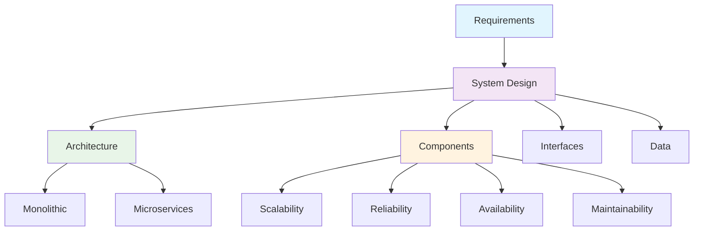

### Question 2: Difference between high-level and low-level design.

**Answer:**

| Feature | High-Level Design (HLD) | Low-Level Design (LLD) |
| :--- | :--- | :--- |
| **Focus** | Overall system architecture and component interactions. | Internal logic of individual components. |
| **Scope** | Macroscopic view (Databases, Servers, APIs). | Microscopic view (Classes, Functions, Algorithms). |
| **Audience** | Architects, Stakeholders. | Developers, Testers. |
| **Outcome** | Architecture diagrams, Technology stack. | Class diagrams, Pseudo-code, Database schemas. |

### How to Explain in Interview (Spoken style format)

**Interviewer:** What's the difference between high-level and low-level design?

**Your Response:** "I think of HLD as the bird's eye view of the system - it's where I decide on the major components like which databases to use, how services communicate, and the overall architecture pattern. For example, I might decide we need a microservices architecture with a PostgreSQL database and Redis for caching. LLD, on the other hand, is where I get into the nitty-gritty details - designing the actual classes, writing the database schemas, defining the APIs between services, and deciding on specific algorithms. HLD is for architects and stakeholders to understand the big picture, while LLD is for developers who need to implement the actual code."

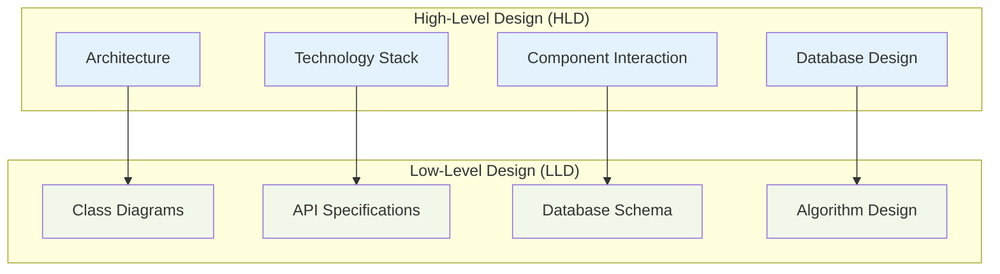

### Question 3: What is scalability? Types of scalability?

**Answer:**
Scalability is the capability of a system to handle a growing amount of work by adding resources to the system.

*   **Vertical Scalability (Scaling Up):** Adding more power (CPU, RAM) to an existing server.
    *   *Pros:* Simple to implement.
    *   *Cons:* Limited by hardware capacity, single point of failure.
*   **Horizontal Scalability (Scaling Out):** Adding more machines to the pool of resources.
    *   *Pros:* Unlimited growth, fault tolerance.
    *   *Cons:* Complex to manage (data consistency, load balancing).

### How to Explain in Interview (Spoken style format)

**Interviewer:** What is scalability and what types are there?

**Your Response:** "Scalability is all about how well a system can handle growth - whether that's more users, more data, or more traffic. There are two main approaches: vertical scaling, which is like making one server more powerful by adding more CPU or RAM - it's simple but you eventually hit a hardware limit. Then there's horizontal scaling, where you add more servers to share the load - this gives you virtually unlimited growth and better fault tolerance, but it's more complex because you need to handle things like data consistency and load balancing across multiple machines. In practice, most large-scale systems use horizontal scaling because it's the only way to handle millions of users."

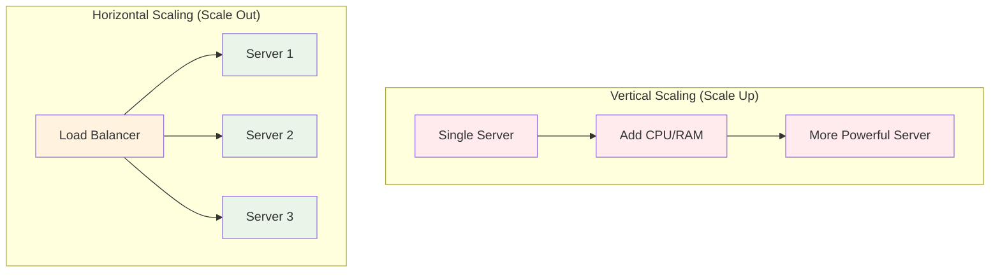

### Question 4: What is a load balancer?

**Answer:**
A load balancer is a device or service that distributes network or application traffic across a cluster of servers.

*   **Purpose:**
    *   Increases capacity (concurrent users) and reliability.
    *   Prevents any single server from becoming a bottleneck.
*   **Types:**
    *   **Layer 4 (Transport):** Based on IP/Port (e.g., TCP/UDP).
    *   **Layer 7 (Application):** Based on content (e.g., HTTP headers, cookies).

### How to Explain in Interview (Spoken style format)

**Interviewer:** What is a load balancer?

**Your Response:** "A load balancer is like a traffic cop for your servers. When you have thousands or millions of users hitting your system, you don't want one server doing all the work while others sit idle. The load balancer sits in front of your application servers and distributes incoming requests across them based on different strategies - it could be round-robin where each server gets a turn, or it could send requests to the server with the fewest active connections. This not only increases your system's capacity to handle more users but also provides reliability - if one server goes down, the load balancer just stops sending traffic to it and routes requests to the healthy servers. It's a critical component for any high-availability system."

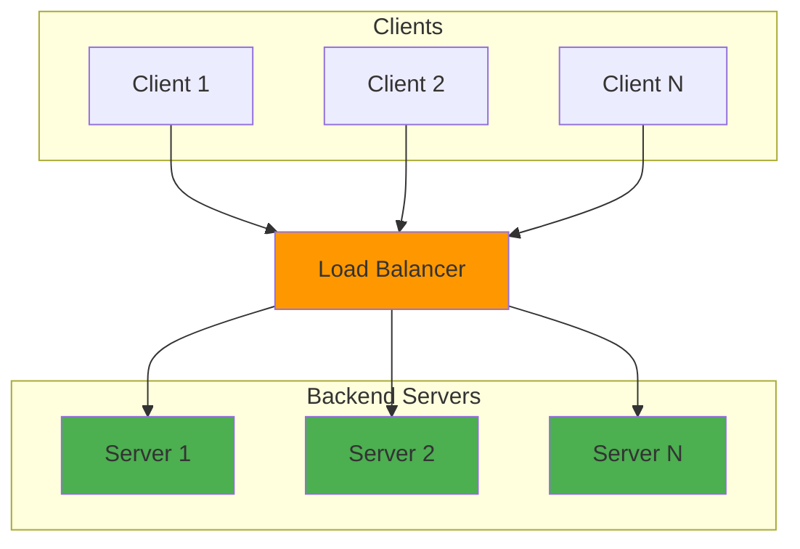

### Question 5: What is caching? Where can it be applied?

**Answer:**
Caching is the process of storing copies of files or data in a temporary storage location (cache) so that they can be accessed more quickly.

*   **Where it is applied:**
    *   **Browser/Client:** Local storage, Cookies.
    *   **CDN:** Static assets closer to users.
    *   **Load Balancer:** Reverse proxy caching.
    *   **Application Layer:** In-memory objects.
    *   **Database:** Query cache (e.g., Redis, Memcached).

### How to Explain in Interview (Spoken style format)

**Interviewer:** What is caching and where can it be applied?

**Your Response:** "Caching is one of the most effective ways to improve system performance. The basic idea is to store frequently accessed data in a faster storage layer so we don't have to hit the database every time. I can implement caching at multiple levels - at the browser level using localStorage, at the CDN level for static assets like images and CSS, at the load balancer level as a reverse proxy cache, within the application itself using in-memory objects, and finally at the database level with query caches. Each layer has its own trade-offs in terms of speed, complexity, and consistency. The key is identifying what data is accessed frequently but doesn't change often - that's perfect cache candidate material."

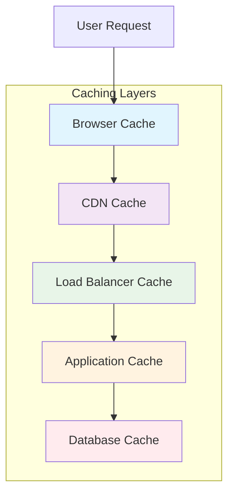

### Question 6: What is CDN and how does it work?

**Answer:**
A Content Delivery Network (CDN) is a geographically distributed network of proxy servers and their data centers.

*   **How it works:**
    *   Users request content (images, videos, CSS).
    *   The request is routed to the nearest edge server (Point of Presence - PoP).
    *   If the content is cached, it's served immediately.
    *   If not, the CDN fetches it from the origin server, caches it, and serves it.
*   **Benefits:** Reduced latency, lower bandwidth costs, higher availability.

### How to Explain in Interview (Spoken style format)

**Interviewer:** What is a CDN and how does it work?

**Your Response:** "A CDN, or Content Delivery Network, is like having warehouses for your content all around the world. Instead of every user having to fetch data from your main server in one location, the CDN stores copies of your static content - images, videos, CSS files - on servers called edge locations that are geographically closer to users. When a user requests content, the CDN automatically routes them to the nearest edge server. If the content is already cached there, it's served immediately. If not, the CDN fetches it from your origin server, caches it for future requests, and serves it to the user. This dramatically reduces latency because the content travels a shorter distance, it lowers your bandwidth costs, and improves availability since if one edge server goes down, users can be routed to another."

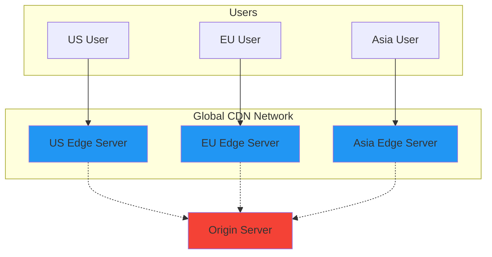

### Question 7: What is a reverse proxy?

**Answer:**
A reverse proxy is a server that sits in front of one or more web servers, intercepting requests from clients.

*   **Functions:**
    *   **Load Balancing:** Distributes traffic.
    *   **Security:** Hides backend server IPs, handles SSL/TLS termination.
    *   **Caching:** Serves static content.
    *   **Compression:** Compresses outgoing data (e.g., Gzip).

### How to Explain in Interview (Spoken style format)

**Interviewer:** What is a reverse proxy?

**Your Response:** "A reverse proxy is a server that sits in front of your backend servers and handles all incoming client requests. Think of it as a front-door security guard and receptionist rolled into one. It handles several important jobs - distributing traffic across multiple backend servers (load balancing), hiding the actual IP addresses of your backend servers for security, handling SSL/TLS encryption so your backend servers don't have to, serving static content directly from cache to reduce load on your backend, and even compressing responses to save bandwidth. Popular reverse proxies like Nginx and Apache are essential components in most web architectures because they improve performance, security, and reliability."

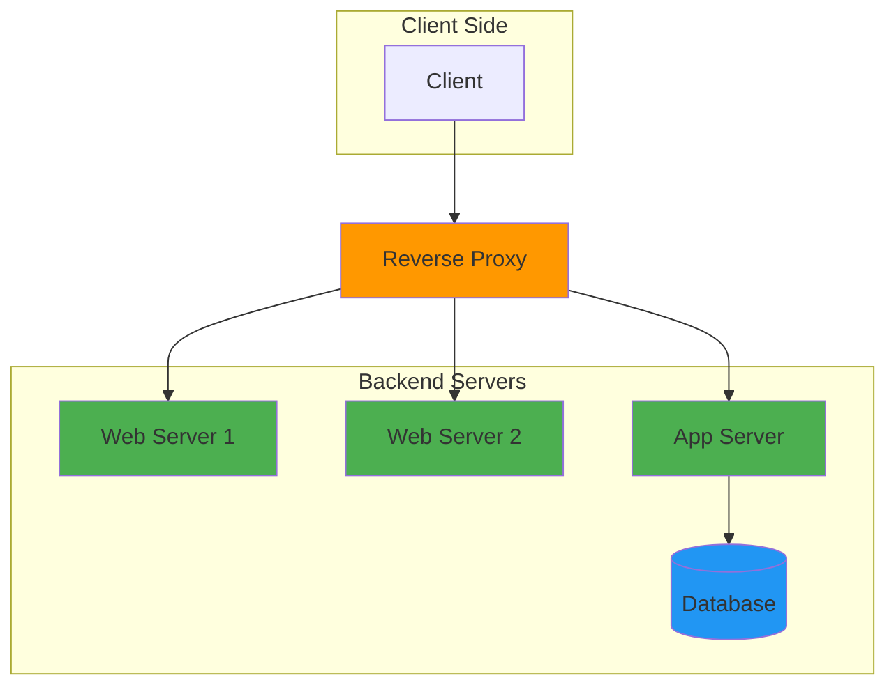

### Question 8: What is a message queue?

**Answer:**
A message queue is a form of asynchronous service-to-service communication used in serverless and microservices architectures.

*   **Mechanism:** Components send messages to a queue (Producer) and other components retrieve them (Consumer).
*   **Benefits:**
    *   **Decoupling:** Producers and consumers don't need to interact directly.
    *   **Scalability:** Consumers can be scaled independently.
    *   **Reliability:** Messages persist until processed.
*   **Examples:** RabbitMQ, Kafka, AWS SQS.

### How to Explain in Interview (Spoken style format)

**Interviewer:** What is a message queue?

**Your Response:** "A message queue is like a postal service for your applications. Instead of services calling each other directly and waiting for a response (which can cause timeouts and failures), one service can send a message to a queue and move on. Another service can then pick up that message whenever it's ready. This decoupling is incredibly powerful - it means if the consumer service is down or busy, the producer doesn't fail. The messages just wait in the queue. It also allows for better scalability since I can have multiple consumers processing messages in parallel, and it provides reliability because messages persist until they're successfully processed. I use message queues for things like sending emails, processing video uploads, or handling order fulfillment - tasks that don't need to happen instantly."

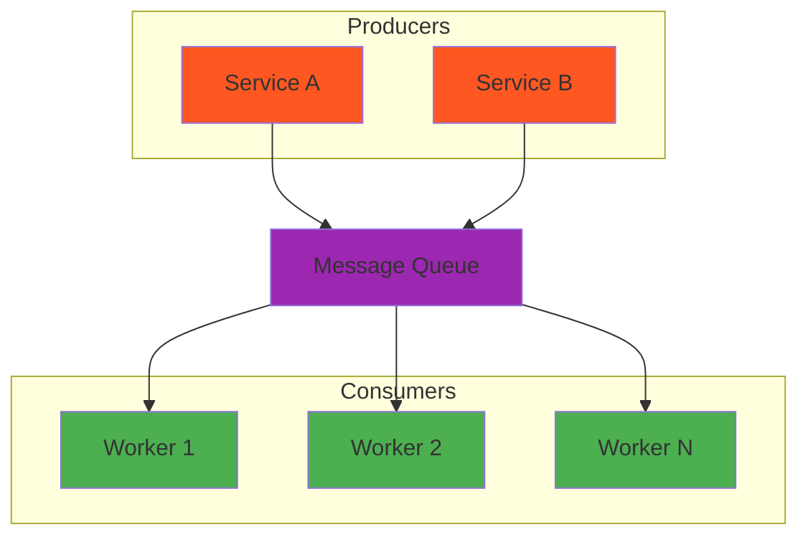

### Question 9: What is sharding?

**Answer:**
Sharding is a method of splitting and storing a single logical dataset in multiple databases.

*   **Process:** Breaking a large database into smaller, faster, more easily managed parts called "shards".
*   **Key Concept:** `Shard Key` determines which shard a row is stored in.
*   **Pros:** Horizontal scaling of writes and storage.
*   **Cons:** Complex queries (joins across shards), uneven data distribution (hotspots).

### How to Explain in Interview (Spoken style format)

**Interviewer:** What is sharding?

**Your Response:** "Sharding is how I handle databases that have grown too large for a single server to handle. Instead of one massive database, I split the data across multiple smaller databases called shards. Each shard holds a subset of the total data. The key is choosing a good shard key - something like user ID or geographic region that determines which shard a particular piece of data lives on. This allows me to scale horizontally - if I need more capacity, I just add more shards. The challenge is that queries that need data from multiple shards become more complex, and I have to be careful about uneven data distribution where one shard gets much more traffic than others. But for systems with massive amounts of data, like social media platforms or e-commerce sites, sharding is often the only way to handle the scale."

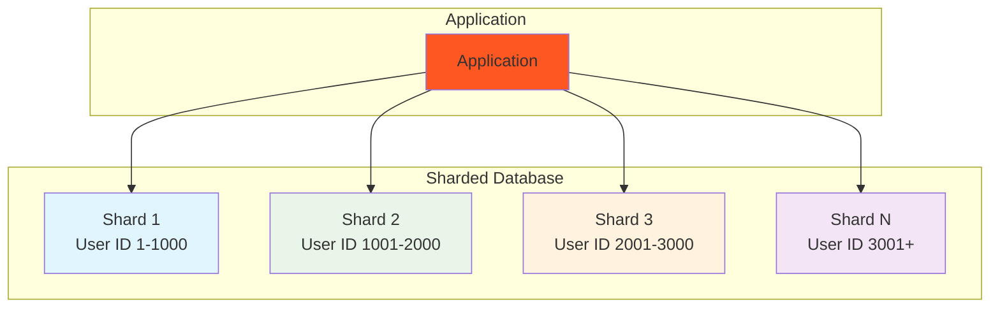

### Question 10: Difference between vertical and horizontal scaling.

**Answer:**

| Feature | Vertical Scaling (Scale Up) | Horizontal Scaling (Scale Out) |
| :--- | :--- | :--- |
| **Method** | Add resources (CPU, RAM) to one node. | Add more nodes to the system. |
| **Complexity** | Low. | High (requires LB, distributed data). |
| **Downtime** | May require downtime for upgrades. | No downtime (add nodes dynamically). |
| **Cost** | Exponential (high-end hardware is pricey). | Linear (commodity hardware). |
| **Limit** | Hard limit (hardware max). | Theoretically unlimited. |

### How to Explain in Interview (Spoken style format)

**Interviewer:** What's the difference between vertical and horizontal scaling?

**Your Response:** "Vertical scaling is like upgrading your computer - you add more CPU, RAM, or storage to a single server to make it more powerful. It's straightforward to implement, but you eventually hit a ceiling because there's only so much hardware you can pack into one machine. Horizontal scaling is like adding more computers to your team - instead of making one server super powerful, you add more servers and distribute the load across them. This is more complex because you need to handle things like load balancing and data consistency across multiple machines, but it gives you virtually unlimited scalability. Most large systems like Netflix or Amazon use horizontal scaling because it's the only approach that can handle millions of users and provides better fault tolerance - if one server fails, the others just pick up the slack."

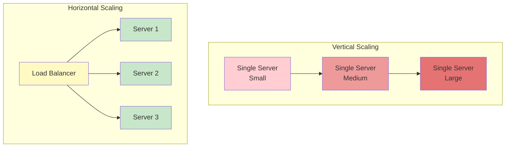

---

## 🟢 Database Design & Management (Questions 11-20)

### Question 11: SQL vs NoSQL – when to use what?

**Answer:**

*   **Use SQL (Relational) when:**
    *   You need ACID compliance (Atomicity, Consistency, Isolation, Durability).
    *   Data is structured and schema remains constant.
    *   Complex queries (JOINs) are required.
    *   Examples: PostgreSQL, MySQL.
*   **Use NoSQL (Non-Relational) when:**
    *   Data is unstructured or semi-structured.
    *   You need high throughput and horizontal scalability.
    *   Flexible schema is needed (rapid development).
    *   Examples: MongoDB (Document), Redis (Key-Value), Cassandra (Wide-Column).

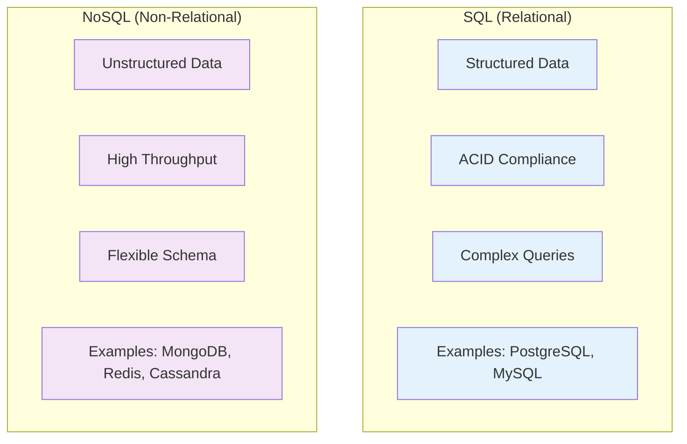

### Question 12: How do you scale a database?

**Answer:**
1.  **Vertical Scaling:** Upgrade the server hardware (limited).
2.  **Read Replicas:** Master-Slave architecture where writes go to Master and reads are distributed to Slaves.
3.  **Sharding (Horizontal Scaling):** Partition data across multiple servers.
4.  **Partitioning:** Split tables into smaller pieces (Vertical partitioning: split columns; Horizontal partitioning: split rows).
5.  **Caching:** Use Redis/Memcached to reduce DB load.

### How to Explain in Interview (Spoken style format)

**Interviewer:** How do you scale a database?

**Your Response:** "Scaling a database is crucial because it's often the bottleneck in a system. I start with vertical scaling - upgrading the server hardware, but that only gets me so far. Then I implement read replicas where all writes go to the master database, but reads are distributed across multiple read-only copies. This works great for read-heavy applications. For write-heavy workloads, I use sharding - splitting the data across multiple databases based on a shard key like user ID. I also use database partitioning to break large tables into smaller, more manageable pieces. And of course, I always implement caching with Redis or Memcached to reduce the actual database load. The key is to match the scaling strategy to the specific workload pattern of the application."

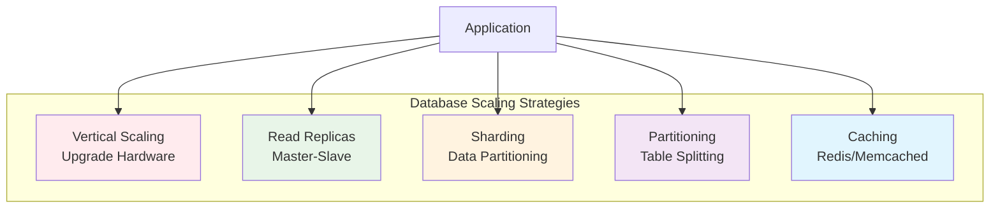

### Question 13: What is denormalization and why is it useful?

**Answer:**
Denormalization is the process of adding redundant data to a normalized database to reduce the number of joins and improve read performance.

*   **Why useful:**
    *   Optimizes read-heavy workloads.
    *   Avoids complex joins.
*   **Trade-off:**
    *   Writes become more complex (need to update multiple places).
    *   Risk of data inconsistency.

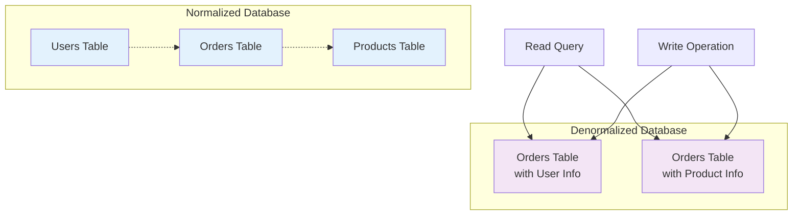

### Question 14: CAP theorem – explain and give examples.

**Answer:**
The CAP theorem states that a distributed system can only provide two of the following three guarantees:
1.  **Consistency:** Every read receives the most recent write or an error.
2.  **Availability:** Every request receives a (non-error) response, without the guarantee that it contains the most recent write.
3.  **Partition Tolerance:** The system survives network failures (message loss between nodes).

*   **Combinations:**
    *   **CP (Consistency + Partition Tolerance):** MongoDB, HBase (System unavailable if partition occurs to preserve consistency).
    *   **AP (Availability + Partition Tolerance):** Cassandra, DynamoDB (System always available, but might return stale data - Eventual Consistency).
    *   **CA:** Not possible in distributed systems (Network partitions are inevitable).

### How to Explain in Interview (Spoken style format)

**Interviewer:** Can you explain the CAP theorem?

**Your Response:** "The CAP theorem is a fundamental concept in distributed systems that says I can only have two out of three guarantees: Consistency, Availability, and Partition Tolerance. Consistency means every read gets the most recent write. Availability means the system always responds, even if some nodes are down. Partition Tolerance means the system continues working even when network messages are lost between nodes. In reality, network partitions will happen, so I must choose between consistency and availability. If I choose consistency like MongoDB does, the system might become unavailable during a partition to avoid serving stale data. If I choose availability like Cassandra does, the system stays up but might serve slightly stale data. The choice depends on the business requirements - for financial systems I'd choose consistency, for social media feeds I'd choose availability."

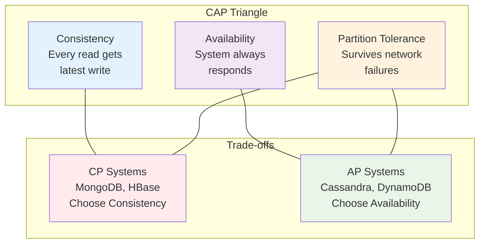

### Question 15: What is eventual consistency?

**Answer:**
A consistency model used in distributed computing to achieve high availability. It guarantees that, if no new updates are made to a given data item, eventually all accesses to that item will return the last updated value.

*   **Use Case:** DNS, Social Media feeds (it's okay if a post appears a few seconds later for some users).
*   **Contrast:** Strong Consistency (RDBMS), where data is instantly consistent across all nodes.

### How to Explain in Interview (Spoken style format)

**Interviewer:** What is eventual consistency?

**Your Response:** "Eventual consistency is a model where the system allows data to be inconsistent for a short period, but guarantees that all copies will eventually converge to the same value. It's like when I post something on social media - my friends might see it a few seconds later than I do, but eventually everyone sees the same content. This is different from strong consistency where every read immediately reflects the most recent write. I use eventual consistency in distributed systems where availability is more important than immediate consistency - things like caching, DNS, or social media feeds. The key is that if no new updates are made, the system will eventually become consistent across all nodes. It's a trade-off I make to achieve high availability and better performance at scale."

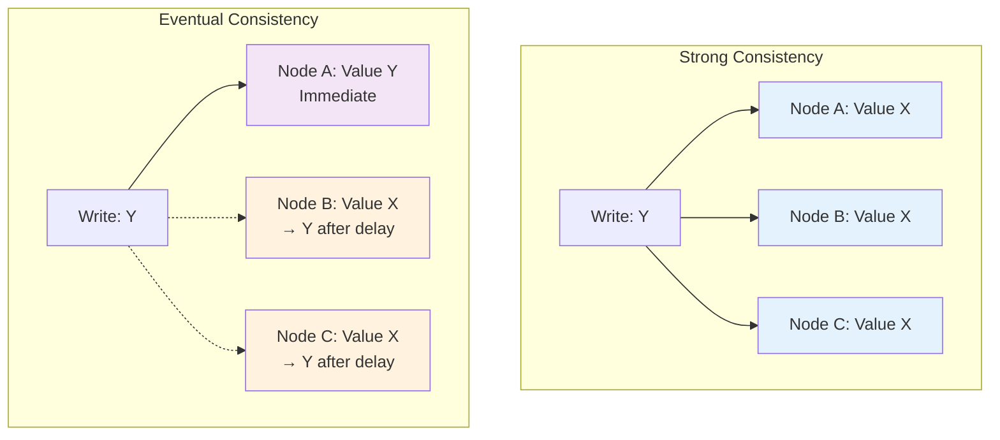

### Question 16: How would you design a schema for a social network?

**Answer:**
*   **Users Table:** `user_id` (PK), `username`, `email`, `password_hash`, `created_at`.
*   **Friendships Table:** `user_id1`, `user_id2`, `status` (pending, accepted), `created_at`.
*   **Posts Table:** `post_id` (PK), `user_id` (FK), `content`, `image_url`, `created_at`.
*   **Comments Table:** `comment_id`, `post_id` (FK), `user_id` (FK), `text`.
*   **Likes Table:** `post_id`, `user_id` (composite PK).
*   **Optimization:** Use Graph DB (Neo4j) for complex relationship queries (friends of friends).

### How to Explain in Interview (Spoken style format)

**Interviewer:** How would you design a schema for a social network?

**Your Response:** "For a social network, I'd start with a Users table with basic profile information. Then I'd create a Friendships table to manage relationships - it's a many-to-many relationship so I need user_id1 and user_id2 columns with a status field to track if the friendship is pending or accepted. For content, I'd have a Posts table with user_id as foreign key, and then Comments and Likes tables that reference posts. The key challenge is scaling - as the network grows, queries like 'friends of friends' become expensive. That's why I might use a graph database like Neo4j for relationship queries, or implement read replicas and caching for common queries. I'd also shard by user_id to distribute the load across multiple database servers."

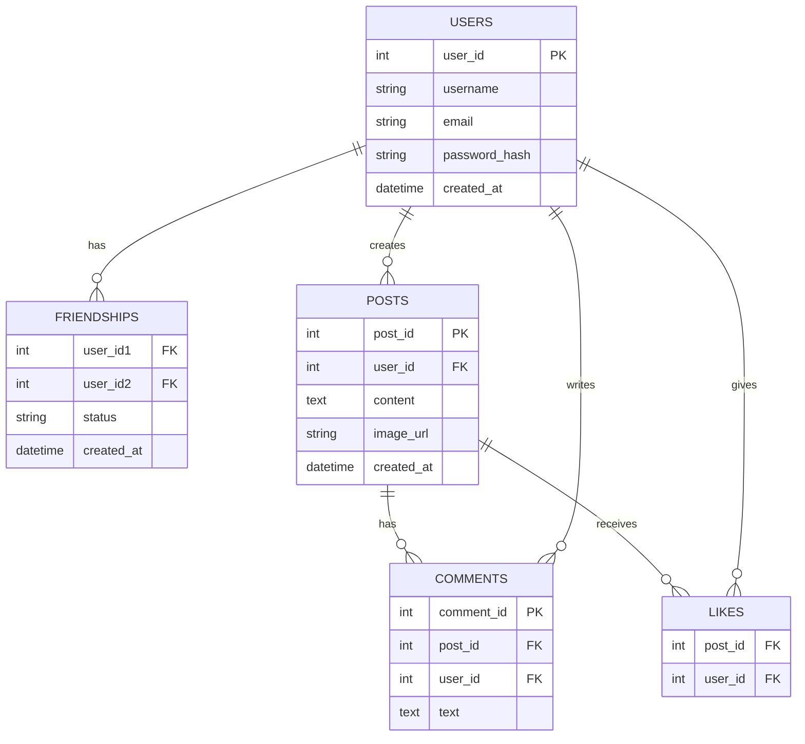

### Question 17: Explain database partitioning.

**Answer:**
Database partitioning is the process of dividing a large database object (like a table) into smaller, manageable pieces, but still treating them as a single logical entity.

*   **Methods:**
    *   **Range Partitioning:** Based on a range of values (e.g., Dates: 2023, 2024).
    *   **List Partitioning:** Based on a list of values (e.g., Regions: US, EU, Asia).
    *   **Hash Partitioning:** Based on a hash function of a key (distributes data evenly).
    *   **Vertical Partitioning:** Moving infrequently used columns to another table.

### How to Explain in Interview (Spoken style format)

**Interviewer:** Can you explain database partitioning?

**Your Response:** "Database partitioning is how I break large tables into smaller, more manageable pieces while still treating them as one logical table. I can partition in different ways - range partitioning where I split data by value ranges like dates (2023 data in one partition, 2024 in another), list partitioning where I group by specific values like regions, or hash partitioning where I use a hash function to distribute data evenly. I also use vertical partitioning to move rarely accessed columns to a separate table. This improves query performance because queries can scan smaller partitions instead of one massive table, and it helps with maintenance operations like backups and index rebuilding. It's especially useful for time-series data where I can easily archive old partitions."

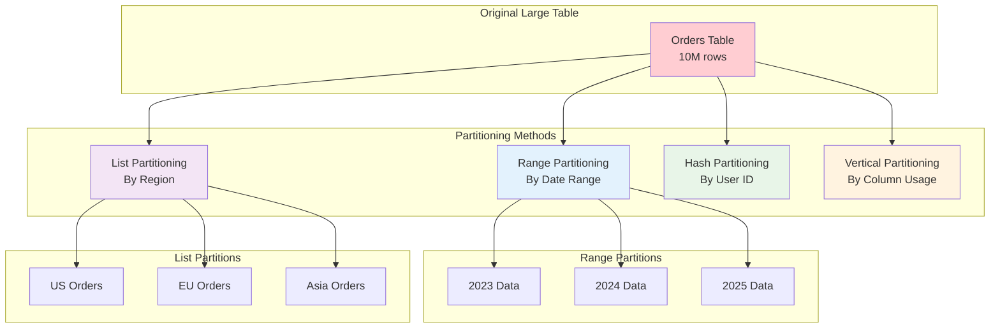

### Question 18: How do you handle schema migrations?

**Answer:**
Schema migrations are managed versions of the database schema.
1.  **Versioning:** Each change is a script with a version number (V1__init.sql, V2__add_column.sql).
2.  **backward Compatibility:** Ensure changes don't break existing application code (e.g., add new column first, deploy code, then remove old column).
3.  **Tools:** Flyway, Liquibase.
4.  **Zero-downtime Approach:**
    *   Add nullable column.
    *   Dual write (write to both old and new).
    *   Backfill data.
    *   Switch reads to new.

### How to Explain in Interview (Spoken style format)

**Interviewer:** How do you handle schema migrations?

**Your Response:** "Schema migrations are one of the trickiest parts of managing a production database. I always version my migration scripts so I can track what changes have been applied and roll back if needed. For zero-downtime deployments, I follow a careful process: first I add the new column as nullable so existing code continues to work, then I deploy the application code that writes to both the old and new columns, then I backfill the data for existing rows, and finally I switch the application to read from the new column and remove the old one. Tools like Flyway or Liquibase help manage this process automatically. The key is making changes backward compatible so I can deploy code changes before database changes without breaking the application."

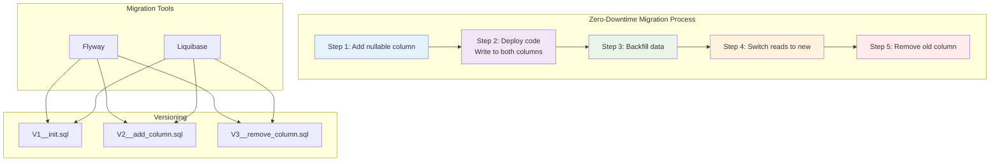

### Question 19: What is a write-ahead log?

**Answer:**
The Write-Ahead Log (WAL) is a standard method for ensuring data integrity using the "logs" before "data" principle.

*   **Mechanism:** Modifications are written to a secure log file *before* they are applied to the database pages.
*   **Purpose:** Atomicity and Durability. If the system crashes, the database can re-execute the log to restore the data to a consistent state.

### How to Explain in Interview (Spoken style format)

**Interviewer:** What is a write-ahead log?

**Your Response:** "A write-ahead log is a safety mechanism that databases use to ensure data integrity. The basic rule is 'log before data' - before the database modifies any actual data pages, it first writes a description of the changes to a log file. This way, if the system crashes mid-transaction, the database can look at the log and either redo the committed changes or undo the uncommitted ones to get back to a consistent state. It's like keeping a detailed diary of every change before actually making it. This ensures the ACID properties - particularly atomicity and durability. Without WAL, a crash could leave the database in a corrupted state. Most modern databases like PostgreSQL and MySQL use this approach to handle crashes gracefully."

```mermaid
sequenceDiagram
    participant Client
    participant WAL as Write-Ahead Log
    participant DB as Database Pages
    participant Disk
    
    Client->>WAL: 1. Write transaction to log
    WAL->>Disk: 2. Flush log to disk
    Disk-->>WAL: 3. Acknowledge log write
    WAL-->>Client: 4. Acknowledge transaction
    
    Note over WAL,DB: Async: Apply changes to data pages
    WAL->>DB: 5. Write changes to pages
    DB->>Disk: 6. Flush pages to disk
    
    Note over Client,Disk: If crash occurs during step 5-6:<br/>Database can recover from log
    
    style WAL fill:#ff9800
    style DB fill:#4caf50
    style Disk fill:#2196f3
```

### Question 20: How to design a time-series database?

**Answer:**
A Time-Series Database (TSDB) is optimized for handling time-stamped data (metrics, events).

*   **Design Considerations:**
    *   **Write Heavy:** Optimized for high ingestion rates (append-only).
    *   **Storage:** efficient compression (delta encoding).
    *   **Query Patterns:** Range queries, aggregations (avg, max over time).
    *   **Retention:** Downsampling (rollups) and automatic expiration of old data.
*   **Example Technologies:** InfluxDB, Prometheus, TimescaleDB.

### How to Explain in Interview (Spoken style format)

**Interviewer:** How would you design a time-series database?

**Your Response:** "A time-series database is optimized for data that's collected over time, like metrics, sensor readings, or stock prices. The key design considerations are different from regular databases - it's write-heavy since we're constantly ingesting new data points, and queries are usually time-based ranges or aggregations. I'd use append-only storage for high write performance, compression techniques like delta encoding since consecutive data points are often similar, and automatic data retention policies to delete old data. The storage would be organized by time ranges, and I'd support efficient queries like 'average CPU usage over the last hour' or 'maximum temperature yesterday'. Technologies like InfluxDB or Prometheus are built specifically for this use case and handle time-series data much more efficiently than traditional databases."

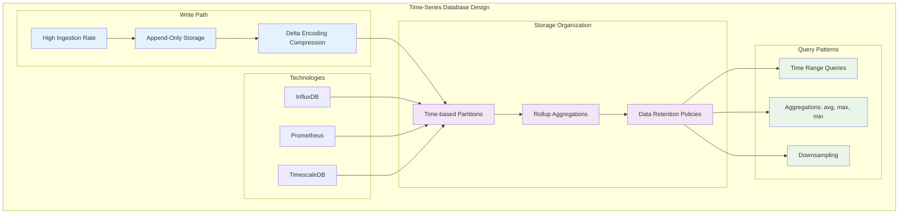

---

## 🟢 Caching & Performance (Questions 21-30)

### Question 21: How to cache data effectively?

**Answer:**
1.  **Identify Hot Data:** Cache frequently accessed, rarely changing data.
2.  **Right Layer:** Choose where to cache (CDN, API Gateway, App, DB).
3.  **TTL (Time To Live):** Set appropriate expiration to balance freshness and hit rate.
4.  **Eviction Policies:** Use LRU (Least Recently Used) for general purpose.
5.  **Serialization:** Store compact formats (Protobuf/MessagePack) to save space.

```mermaid
graph TB
    subgraph "Effective Caching Strategy"
        HD[Identify Hot Data<br/>Frequent access<br/>Rare changes]
        RL[Choose Right Layer<br/>CDN, API Gateway<br/>App, Database]
        TTL[Set Appropriate TTL<br/>Balance freshness<br/>and hit rate]
        EP[Use Eviction Policies<br/>LRU, LFU, FIFO]
        SER[Compact Serialization<br/>Protobuf, MessagePack]
    end
    
    subgraph "Cache Layers"
        CDN[CDN Cache]
        GW[API Gateway Cache]
        APP[Application Cache]
        DB[Database Cache]
    end
    
    HD --> RL
    RL --> TTL
    TTL --> EP
    EP --> SER
    
    RL --> CDN
    RL --> GW
    RL --> APP
    RL --> DB
    
    style HD fill:#e3f2fd
    style RL fill:#f3e5f5
    style TTL fill:#e8f5e8
    style EP fill:#fff3e0
    style SER fill:#ffebee
```

### Question 22: What is cache eviction policy? (LRU, LFU, FIFO)

**Answer:**
Determines which item to discard when the cache is full to make room for new items.
*   **LRU (Least Recently Used):** Discards the least recently used items first. (Most common).
*   **LFU (Least Frequently Used):** Discards items used least often. (Good for stable access patterns).
*   **FIFO (First In First Out):** Discards the oldest items first. (Simple queue).

```mermaid
graph TB
    subgraph "Cache Eviction Policies"
        LRU[LRU<br/>Least Recently Used]
        LFU[LFU<br/>Least Frequently Used]
        FIFO[FIFO<br/>First In First Out]
    end
    
    subgraph "LRU Example"
        L1[Item A: Used 5min ago]
        L2[Item B: Used 2min ago]
        L3[Item C: Used 10min ago]
        L4[New Item: Need space]
        
        L4 -.->|Evicts| L3
    end
    
    subgraph "LFU Example"
        F1[Item A: Used 50 times]
        F2[Item B: Used 10 times]
        F3[Item C: Used 5 times]
        F4[New Item: Need space]
        
        F4 -.->|Evicts| F3
    end
    
    subgraph "FIFO Example"
        I1[Item A: Inserted 10min ago]
        I2[Item B: Inserted 5min ago]
        I3[Item C: Inserted 2min ago]
        I4[New Item: Need space]
        
        I4 -.->|Evicts| I1
    end
    
    style LRU fill:#e3f2fd
    style LFU fill:#f3e5f5
    style FIFO fill:#e8f5e8
```

### Question 23: Difference between Redis and Memcached.

**Answer:**

| Feature | Redis | Memcached |
| :--- | :--- | :--- |
| **Data Types** | Strings, Hashes, Lists, Sets, Sorted Sets. | Strings only. |
| **Persistence** | Yes (RDB snapshots, AOF logs). | No (In-memory only). |
| **Replication** | Yes (Master-Slave). | No. |
| **Pub/Sub** | Yes. | No. |
| **Use Case** | Complex Caching, Message Broker, Leaderboards. | Simple Key-Value Caching. |

```mermaid
graph TB
    subgraph "Redis Features"
        R1[Multiple Data Types<br/>Strings, Hashes, Lists]
        R2[Persistence<br/>RDB, AOF]
        R3[Replication<br/>Master-Slave]
        R4[Pub/Sub<br/>Message Broadcasting]
        R5[Complex Use Cases<br/>Leaderboards, Sessions]
    end
    
    subgraph "Memcached Features"
        M1[Simple Strings Only]
        M2[No Persistence<br/>Memory Only]
        M3[No Replication]
        M4[No Pub/Sub]
        M5[Simple Caching<br/>Key-Value Store]
    end
    
    subgraph "Use Cases"
        UC1[Session Storage]
        UC2[Real-time Analytics]
        UC3[Message Queues]
        UC4[Simple Cache]
    end
    
    R1 --> UC1
    R2 --> UC1
    R3 --> UC2
    R4 --> UC3
    R5 --> UC2
    
    M1 --> UC4
    M2 --> UC4
    M3 --> UC4
    M4 --> UC4
    M5 --> UC4
    
    style R1 fill:#e3f2fd
    style R2 fill:#e3f2fd
    style R3 fill:#e3f2fd
    style R4 fill:#e3f2fd
    style R5 fill:#e3f2fd
    style M1 fill:#f3e5f5
    style M2 fill:#f3e5f5
    style M3 fill:#f3e5f5
    style M4 fill:#f3e5f5
    style M5 fill:#f3e5f5
```

### Question 24: What are the downsides of caching?

**Answer:**
1.  **Stale Data:** Users might see outdated information.
2.  **Complexity:** Cache invalidation is hard to implement correctly.
3.  **Memory Cost:** RAM is expensive compared to disk.
4.  **Cache Penalties:** A "cache miss" adds latency (lookup cache + lookup DB).
5.  **Thundering Herd:** If cache goes down, DB might get overwhelmed.

```mermaid
graph TB
    subgraph "Caching Downsides"
        SD[Stale Data<br/>Users see<br/>outdated info]
        CX[Complexity<br/>Cache invalidation<br/>is hard]
        MC[Memory Cost<br/>RAM is expensive<br/>vs disk]
        CP[Cache Penalties<br/>Miss adds latency<br/>cache + DB lookup]
        TH[Thundering Herd<br/>Cache down<br/>DB overwhelmed]
    end
    
    subgraph "Impact Examples"
        E1[User sees old<br/>price on product]
        E2[Complex logic<br/>to invalidate]
        E3[High server<br/>memory costs]
        E4[Slower response<br/>on cache miss]
        E5[Database crash<br/>from traffic spike]
    end
    
    SD --> E1
    CX --> E2
    MC --> E3
    CP --> E4
    TH --> E5
    
    style SD fill:#ffcdd2
    style CX fill:#f8bbd9
    style MC fill:#e1bee7
    style CP fill:#c5cae9
    style TH fill:#c8e6c9
```

### Question 25: How to handle cache invalidation?

**Answer:**
*   **Write-through:** Write to cache and DB simultaneously. (Consistent, but slow write).
*   **Cache-Aside (Lazy Loading):** App checks cache; if miss, reads DB and updates cache. (Inconsistent for a short time).
*   **TTL (Time-to-Live):** Auto-expire keys. (Simplest).
*   **Write-behind (Write-back):** Write to cache, async write to DB. (Fast write, risk of data loss).

```mermaid
sequenceDiagram
    participant App as Application
    participant Cache
    participant DB as Database
    
    Note over App,DB: Write-Through Pattern
    App->>Cache: 1. Write data
    App->>DB: 2. Write data
    DB-->>App: 3. Acknowledge
    Cache-->>App: 4. Acknowledge
    
    Note over App,DB: Cache-Aside Pattern
    App->>Cache: 1. Check cache
    Cache-->>App: 2. Cache miss
    App->>DB: 3. Read from DB
    DB-->>App: 4. Return data
    App->>Cache: 5. Update cache
    
    Note over App,DB: Write-Behind Pattern
    App->>Cache: 1. Write data
    Cache-->>App: 2. Immediate ack
    Note over Cache,DB: Async: Write to DB
    Cache->>DB: 3. Write data (async)
    
    style Cache fill:#ff9800
    style DB fill:#4caf50
```

### Question 26: What is a write-through vs write-back cache?

**Answer:**
*   **Write-Through:** Data is written to the cache and the backing store (DB) at the same time.
    *   *Pros:* Data consistency, reliability.
    *   *Cons:* Higher write latency.
*   **Write-Back (Write-Behind):** Data is written only to the cache initially and confirmed. The cache writes to the DB later in the background.
    *   *Pros:* Low write latency.
    *   *Cons:* Risk of data loss if cache fails before sync.

```mermaid
timeline
    title Write-Through vs Write-Back Cache
    
    section Write-Through
        Write Request : Cache + DB
        Immediate : Both written
        Result : High latency<br/>Strong consistency
    
    section Write-Back
        Write Request : Cache only
        Immediate : Fast response
        Background : Async DB write
        Result : Low latency<br/>Risk of data loss
```

### Question 27: What happens when cache is full?

**Answer:**
When the cache reaches its memory limit, the **Eviction Policy** kicks in to remove items.
*   If **LRU** is configured, it removes the item accessed longest ago.
*   If **No Eviction** is configured, the cache will return errors on write operations.

```mermaid
graph TB
    subgraph "Cache Memory Management"
        FULL[Cache Full<br/>Memory limit reached]
        POLICY[Eviction Policy<br/>Activates]
        REMOVE[Remove Items<br/>Based on policy]
        SPACE[Free Space<br/>Available]
    end
    
    subgraph "Eviction Outcomes"
        LRU_OUT[LRU: Remove<br/>least recently used]
        LFU_OUT[LFU: Remove<br/>least frequently used]
        FIFO_OUT[FIFO: Remove<br/>oldest items]
        NO_EVICT[No Eviction:<br/>Return errors]
    end
    
    subgraph "New Operations"
        NEW_WRITE[New write<br/>operation]
        SUCCESS[Write succeeds<br/>Cache updated]
        ERROR[Write fails<br/>Error returned]
    end
    
    FULL --> POLICY
    POLICY --> REMOVE
    REMOVE --> SPACE
    
    POLICY --> LRU_OUT
    POLICY --> LFU_OUT
    POLICY --> FIFO_OUT
    POLICY --> NO_EVICT
    
    LRU_OUT --> SUCCESS
    LFU_OUT --> SUCCESS
    FIFO_OUT --> SUCCESS
    NO_EVICT --> ERROR
    
    NEW_WRITE --> SUCCESS
    NEW_WRITE --> ERROR
    
    style FULL fill:#ffcdd2
    style POLICY fill:#fff9c4
    style REMOVE fill:#c8e6c9
    style SPACE fill:#e1f5fe
```

### Question 28: How do you prevent cache stampede?

**Answer:**
Cache stampede (or thundering herd) occurs when a popular cache key expires, and many requests simultaneously hit the DB to regenerate it.
*   **Solutions:**
    *   **Locking/Mutex:** Only one process regenerates the key; others wait.
    *   **Probabilistic Early Expiration:** Expire key slightly before actual TTL randomly.
    *   **Use existing value:** Serve stale value while background process updates it.

```mermaid
sequenceDiagram
    participant Client1
    participant Client2
    participant Client3
    participant Cache
    participant DB
    participant Lock
    
    Note over Client1,DB: Cache Stampede Problem
    Client1->>Cache: Request key (expired)
    Cache-->>Client1: Cache miss
    Client1->>DB: Load from DB
    
    Client2->>Cache: Request key (expired)
    Cache-->>Client2: Cache miss
    Client2->>DB: Load from DB
    
    Client3->>Cache: Request key (expired)
    Cache-->>Client3: Cache miss
    Client3->>DB: Load from DB
    
    Note over Client1,DB: Solution: Locking
    Client1->>Lock: Acquire lock
    Client1->>DB: Load from DB (only once)
    DB-->>Client1: Return data
    Client1->>Cache: Update cache
    Client1->>Lock: Release lock
    
    Client2->>Lock: Try acquire lock (fails)
    Client2->>Cache: Wait for cache update
    Cache-->>Client2: Return fresh data
    
    style Cache fill:#ff9800
    style DB fill:#f44336
    style Lock fill:#4caf50
```

### Question 29: What is CDN caching vs local caching?

**Answer:**
*   **CDN Caching:** Caches static content (images, JS, CSS) at edge servers globally. Reduces latency for geographically distributed users.
*   **Local Caching:** Caches data within the client's browser (localStorage) or the application server's memory. Reduces network requests to the backend.

```mermaid
graph TB
    subgraph "CDN Caching"
        User1[US User]
        User2[EU User]
        User3[Asia User]
        
        CDN_US[US Edge Server<br/>Cache: images, CSS]
        CDN_EU[EU Edge Server<br/>Cache: images, CSS]
        CDN_AS[Asia Edge Server<br/>Cache: images, CSS]
        
        Origin[Origin Server]
        
        User1 --> CDN_US
        User2 --> CDN_EU
        User3 --> CDN_AS
        
        CDN_US -.-> Origin
        CDN_EU -.-> Origin
        CDN_AS -.-> Origin
    end
    
    subgraph "Local Caching"
        Browser[Browser Cache<br/>localStorage, sessionStorage]
        App[Application Cache<br/>In-memory objects]
        Server[Server Cache<br/>Redis/Memcached]
        
        Client[Client Request]
        
        Client --> Browser
        Browser --> App
        App --> Server
    end
    
    style CDN_US fill:#2196f3
    style CDN_EU fill:#2196f3
    style CDN_AS fill:#2196f3
    style Origin fill:#f44336
    style Browser fill:#4caf50
    style App fill:#ff9800
    style Server fill:#9c27b0
```

### Question 30: Where do you place caching in a web architecture?

**Answer:**
1.  **Client Side:** Browser Cache.
2.  **DNS:** DNS Caching.
3.  **Web Server:** Reverse Proxy Cache (Nginx).
4.  **Application:** In-memory Cache (local map).
5.  **Distributed Cache:** Redis/Memcached cluster.
6.  **Database:** Internal Buffer Pool/Query Cache.

```mermaid
graph TB
    subgraph "Web Architecture Cache Layers"
        Client[Client Browser<br/>Browser Cache]
        DNS[DNS Server<br/>DNS Cache]
        CDN[CDN Edge<br/>Static Content Cache]
        LB[Load Balancer<br/>Reverse Proxy Cache]
        App[Application Server<br/>In-memory Cache]
        Redis[Redis Cluster<br/>Distributed Cache]
        DB[Database<br/>Query Cache]
    end
    
    User[User Request]
    
    User --> Client
    Client --> DNS
    DNS --> CDN
    CDN --> LB
    LB --> App
    App --> Redis
    Redis --> DB
    
    subgraph "Cache Types"
        CT1[Client-side<br/>localStorage, cookies]
        CT2[Edge caching<br/>CDN, proxy]
        CT3[Application caching<br/>local objects]
        CT4[Distributed caching<br/>Redis, Memcached]
        CT5[Database caching<br/>buffer pool]
    end
    
    Client -.-> CT1
    CDN -.-> CT2
    App -.-> CT3
    Redis -.-> CT4
    DB -.-> CT5
    
    style Client fill:#e3f2fd
    style DNS fill:#f3e5f5
    style CDN fill:#e8f5e8
    style LB fill:#fff3e0
    style App fill:#ffebee
    style Redis fill:#f8bbd9
    style DB fill:#c5cae9
```

---

## 🟢 Load Balancing (Questions 31-40)

### Question 31: What is a load balancer?

**Answer:**
(Repeated concept but typically asked deeply)
A component that distributes incoming network traffic across multiple servers to ensure no single server bears too much load. It ensures high availability and reliability.

```mermaid
graph TB
    subgraph "Load Balancer Architecture"
        Users[Multiple Users]
        LB[Load Balancer]
        
        subgraph "Backend Servers"
            S1[Server 1]
            S2[Server 2]
            S3[Server 3]
            S4[Server N]
        end
        
        subgraph "Load Balancing Functions"
            F1[Traffic Distribution]
            F2[Health Checks]
            F3[SSL Termination]
            F4[Session Persistence]
        end
    end
    
    Users --> LB
    LB --> S1
    LB --> S2
    LB --> S3
    LB --> S4
    
    LB -.-> F1
    LB -.-> F2
    LB -.-> F3
    LB -.-> F4
    
    style LB fill:#ff9800
    style S1 fill:#4caf50
    style S2 fill:#4caf50
    style S3 fill:#4caf50
    style S4 fill:#4caf50
```

### Question 32: Types of load balancing strategies.

**Answer:**
1.  **Round Robin:** Sequential request distribution.
2.  **Least Connections:** Sends request to server with fewest active connections.
3.  **IP Hash:** Hashes client IP to assign a specific server (sticky).
4.  **Weighted Round Robin:** Assigns more requests to powerful servers.
5.  **Least Response Time:** select server with lowest latency.

```mermaid
graph TB
    subgraph "Load Balancing Strategies"
        RR[Round Robin<br/>1→2→3→1→2→3]
        LC[Least Connections<br/>Server with<br/>fewest connections]
        IPH[IP Hash<br/>Client IP % N<br/>= Server]
        WRR[Weighted Round Robin<br/>Powerful servers<br/>get more requests]
        LRT[Least Response Time<br/>Fastest responding<br/>server]
    end
    
    subgraph "Strategy Examples"
        RR_EX[Req1→S1, Req2→S2, Req3→S3]
        LC_EX[S1:5 cons, S2:2 cons, S3:8 cons<br/>New request → S2]
        IP_EX[IP:192.168.1.1 → S1<br/>IP:192.168.1.2 → S2]
        WRR_EX[S1(2x): Req1, Req2<br/>S2(1x): Req3]
        LRT_EX[S1:50ms, S2:100ms, S3:25ms<br/>New request → S3]
    end
    
    RR --> RR_EX
    LC --> LC_EX
    IPH --> IP_EX
    WRR --> WRR_EX
    LRT --> LRT_EX
    
    style RR fill:#e3f2fd
    style LC fill:#f3e5f5
    style IPH fill:#e8f5e8
    style WRR fill:#fff3e0
    style LRT fill:#ffebee
```

### Question 33: How do you implement sticky sessions?

**Answer:**
Sticky sessions (Session Affinity) ensure a user always connects to the same server.
*   **Methods:**
    *   **Source IP Hashing:** Load balancer hash client IP.
    *   **Cookies:** LB injects a tracking cookie (e.g., `SERVERID`) into the response. Subsequent requests with this cookie are routed to the same server.
*   **Trade-off:** If that server fails, session data might be lost (unless stored in external Redis).

```mermaid
sequenceDiagram
    participant Client
    participant LB as Load Balancer
    participant S1 as Server 1
    participant S2 as Server 2
    
    Note over Client,S2: First Request
    Client->>LB: HTTP Request
    LB->>S1: Route to Server 1
    S1-->>LB: Response + Set-Cookie: SERVERID=S1
    LB-->>Client: Response + Cookie
    
    Note over Client,S2: Subsequent Requests (Sticky)
    Client->>LB: HTTP Request + Cookie: SERVERID=S1
    LB->>S1: Route to Server 1 (based on cookie)
    S1-->>LB: Response
    LB-->>Client: Response
    
    Note over Client,S2: Server Failure Scenario
    S1-xLB: Server 1 crashes
    Client->>LB: Request + Cookie: SERVERID=S1
    LB->>S2: Route to Server 2 (fallback)
    Note over Client,S2: Session lost unless<br/>stored externally
    
    style LB fill:#ff9800
    style S1 fill:#4caf50
    style S2 fill:#2196f3
```

### Question 34: What are health checks in load balancing?

**Answer:**
Health checks are periodic probes sent by the LB to backend servers to ensure they are available.
*   **Active Check:** LB pings `/health` endpoint every X seconds.
*   **Passive Check:** LB monitors real traffic; if a server returns errors (5xx), it's marked unhealthy.
*   If a server is unhealthy, the LB stops sending traffic to it until it recovers.

```mermaid
graph TB
    subgraph "Health Check Mechanisms"
        LB[Load Balancer]
        
        subgraph "Backend Servers"
            S1[Server 1<br/>Healthy]
            S2[Server 2<br/>Unhealthy]
            S3[Server 3<br/>Healthy]
        end
        
        subgraph "Health Check Types"
            AC[Active Check<br/>Ping /health endpoint]
            PC[Passive Check<br/>Monitor 5xx errors]
        end
        
        subgraph "Server States"
            Healthy[Healthy<br/>Receive traffic]
            Unhealthy[Unhealthy<br/>No traffic]
            Recovering[Recovering<br/>Being tested]
        end
    end
    
    LB --> S1
    LB -.-> S2
    LB --> S3
    
    LB -.-> AC
    LB -.-> PC
    
    AC --> S1
    AC --> S2
    AC --> S3
    
    PC --> S1
    PC --> S2
    PC --> S3
    
    S1 --> Healthy
    S2 --> Unhealthy
    S3 --> Healthy
    
    S2 -.-> Recovering
    
    style LB fill:#ff9800
    style S1 fill:#4caf50
    style S2 fill:#f44336
    style S3 fill:#4caf50
    style AC fill:#2196f3
    style PC fill:#9c27b0
```

### Question 35: Difference between Layer 4 and Layer 7 load balancers.

**Answer:**

| Feature | Layer 4 (Transport) | Layer 7 (Application) |
| :--- | :--- | :--- |
| **OSI Layer** | Transport Layer (TCP/UDP). | Application Layer (HTTP/HTTPS). |
| **Visibility** | Sees IP and Port only. | Sees URL, Headers, Cookies, Payroll. |
| **Logic** | Simple packet routing. | Smart routing (e.g., `/api` -> Service A, `/images` -> Service B). |
| **Performance** | Very High. | High (CPU intensive due to SSL/Parsing). |

```mermaid
graph TB
    subgraph "Layer 4 Load Balancer"
        L4[Layer 4 LB]
        
        subgraph "L4 Processing"
            L4_IP[Source/Dest IP]
            L4_Port[Source/Dest Port]
            L4_TCP[TCP/UDP Headers]
        end
        
        subgraph "L4 Backend"
            L4_S1[Server 1: Port 80]
            L4_S2[Server 2: Port 80]
        end
        
        Client4[Client] --> L4
        L4 --> L4_IP
        L4 --> L4_Port
        L4 --> L4_TCP
        L4 --> L4_S1
        L4 --> L4_S2
    end
    
    subgraph "Layer 7 Load Balancer"
        L7[Layer 7 LB]
        
        subgraph "L7 Processing"
            L7_URL[HTTP URL Path]
            L7_Headers[HTTP Headers]
            L7_Cookies[Cookies]
            L7_SSL[SSL Termination]
        end
        
        subgraph "L7 Backend"
            L7_API[API Service]
            L7_WEB[Web Service]
            L7_IMG[Image Service]
        end
        
        Client7[Client] --> L7
        L7 --> L7_URL
        L7 --> L7_Headers
        L7 --> L7_Cookies
        L7 --> L7_SSL
        
        L7 --> L7_API
        L7 --> L7_WEB
        L7 --> L7_IMG
    end
    
    style L4 fill:#2196f3
    style L7 fill:#ff9800
    style L4_S1 fill:#4caf50
    style L4_S2 fill:#4caf50
    style L7_API fill:#9c27b0
    style L7_WEB fill:#9c27b0
    style L7_IMG fill:#9c27b0
```

### Question 36: What is DNS load balancing?

**Answer:**
Distributing traffic using the Domain Name System (DNS).
*   **Mechanism:** When a user resolves `example.com`, the DNS server returns one IP from a list of multiple server IPs (often typically Round Robin).
*   **Pros:** Simple, cheap.
*   **Cons:** DNS caching (by ISPs/Browsers) makes it hard to remove a down server instantly.

```mermaid
graph TB
    subgraph "DNS Load Balancing"
        User[User Request]
        DNS[DNS Server]
        
        subgraph "Server IPs"
            IP1[192.168.1.10<br/>Server 1]
            IP2[192.168.1.11<br/>Server 2]
            IP3[192.168.1.12<br/>Server 3]
        end
        
        subgraph "Backend Servers"
            S1[Server 1]
            S2[Server 2]
            S3[Server 3]
        end
        
        subgraph "DNS Caching"
            ISP[ISP DNS Cache]
            Browser[Browser Cache]
        end
    end
    
    User --> DNS
    DNS --> IP1
    DNS --> IP2
    DNS --> IP3
    
    IP1 --> S1
    IP2 --> S2
    IP3 --> S3
    
    DNS -.-> ISP
    ISP -.-> Browser
    
    style DNS fill:#ff9800
    style S1 fill:#4caf50
    style S2 fill:#4caf50
    style S3 fill:#4caf50
    style ISP fill:#2196f3
    style Browser fill:#9c27b0
```

### Question 37: Explain round-robin vs least connections algorithm.

**Answer:**
*   **Round Robin:** 
    *   *Logic:* Cyclic order (Server A -> B -> C -> A).
    *   *Best for:* Servers with identical specs and stateless connections.
*   **Least Connections:**
    *   *Logic:* Dynamic. Routing to the server with the lowest current load (active connections).
    *   *Best for:* Long-lived connections (WebSocket) or varying request processing times.

```mermaid
graph TB
    subgraph "Round Robin Algorithm"
        RR_LB[Load Balancer]
        RR_S1[Server A<br/>Current: Request 3]
        RR_S2[Server B<br/>Current: Request 1]
        RR_S3[Server C<br/>Current: Request 2]
        
        RR_Flow[Request Flow:<br/>A→B→C→A→B→C]
        
        RR_LB --> RR_S1
        RR_LB --> RR_S2
        RR_LB --> RR_S3
        
        RR_LB -.-> RR_Flow
    end
    
    subgraph "Least Connections Algorithm"
        LC_LB[Load Balancer]
        LC_S1[Server A<br/>Connections: 5]
        LC_S2[Server B<br/>Connections: 2]
        LC_S3[Server C<br/>Connections: 8]
        
        LC_Decision[New Request → Server B<br/>(Fewest connections)]
        
        LC_LB --> LC_S1
        LC_LB --> LC_S2
        LC_LB --> LC_S3
        
        LC_LB -.-> LC_Decision
    end
    
    style RR_LB fill:#e3f2fd
    style LC_LB fill:#f3e5f5
    style RR_S1 fill:#4caf50
    style RR_S2 fill:#4caf50
    style RR_S3 fill:#4caf50
    style LC_S1 fill:#ff9800
    style LC_S2 fill:#4caf50
    style LC_S3 fill:#f44336
```

### Question 38: How to handle load balancer failures?

**Answer:**
To prevent the LB from becoming a Single Point of Failure (SPOF):
*   **Active-Passive Setup:** Two LBs; one is active, the other is standby. They monitor each other using heartbeats (e.g., VRRP/Keepalived). If active fails, passive takes over the Virtual IP (VIP).
*   **Active-Active:** Both LBs accept traffic, distributed by DNS.

```mermaid
graph TB
    subgraph "Active-Passive Setup"
        VIP[Virtual IP<br/>192.168.1.100]
        
        subgraph "Load Balancers"
            LB_Active[Active LB<br/>Handling traffic]
            LB_Passive[Passive LB<br/>Standby]
        end
        
        HB[Heartbeat<br/>Health monitoring]
        
        subgraph "Backend Servers"
            AP_S1[Server 1]
            AP_S2[Server 2]
            AP_S3[Server 3]
        end
        
        VIP --> LB_Active
        LB_Active --> AP_S1
        LB_Active --> AP_S2
        LB_Active --> AP_S3
        
        LB_Active -.-> HB
        HB -.-> LB_Passive
        
        LB_Passive -.->|Failover| VIP
    end
    
    subgraph "Active-Active Setup"
        DNS[DNS Round Robin]
        
        subgraph "Both LBs Active"
            AA_LB1[LB 1<br/>IP: 192.168.1.101]
            AA_LB2[LB 2<br/>IP: 192.168.1.102]
        end
        
        subgraph "Backend"
            AA_S1[Server 1]
            AA_S2[Server 2]
        end
        
        DNS --> AA_LB1
        DNS --> AA_LB2
        
        AA_LB1 --> AA_S1
        AA_LB1 --> AA_S2
        AA_LB2 --> AA_S1
        AA_LB2 --> AA_S2
    end
    
    style VIP fill:#ff9800
    style LB_Active fill:#4caf50
    style LB_Passive fill:#9e9e9e
    style AA_LB1 fill:#4caf50
    style AA_LB2 fill:#4caf50
```

### Question 39: What is geo-load balancing?

**Answer:**
Distributing traffic based on the user's geographic location.
*   **Mechanism:** DNS or Global Traffic Manager (GTM) detects user IP.
*   **Routing:** Routes user to the nearest data center.
*   **Benefit:** Lowest latency, compliance with data residency laws.

```mermaid
graph TB
    subgraph "Global Traffic Manager"
        GTM[Geo DNS/GTM]
        
        subgraph "Users Worldwide"
            US_User[US User<br/>IP: 1.2.3.x]
            EU_User[EU User<br/>IP: 5.6.7.x]
            AS_User[Asia User<br/>IP: 9.10.11.x]
        end
        
        subgraph "Regional Data Centers"
            US_DC[US Data Center<br/>New York]
            EU_DC[EU Data Center<br/>Frankfurt]
            AS_DC[Asia Data Center<br/>Singapore]
        end
        
        subgraph "Regional Services"
            US_SVC[US Services<br/>Low latency for US]
            EU_SVC[EU Services<br/>Low latency for EU]
            AS_SVC[Asia Services<br/>Low latency for Asia]
        end
    end
    
    US_User --> GTM
    EU_User --> GTM
    AS_User --> GTM
    
    GTM --> US_DC
    GTM --> EU_DC
    GTM --> AS_DC
    
    US_DC --> US_SVC
    EU_DC --> EU_SVC
    AS_DC --> AS_SVC
    
    style GTM fill:#ff9800
    style US_DC fill:#4caf50
    style EU_DC fill:#2196f3
    style AS_DC fill:#9c27b0
```

### Question 40: How to design a multi-region load balancing setup?

**Answer:**
1.  **DNS Level (GSLB):** Route user to the nearest Region (e.g., US-East vs EU-West).
2.  **Regional LB:** At the entry of the region (AWS ALB/Gateway).
3.  **Local LB:** Distributes to internal microservices/pods.
4.  **Failover:** If an entire region goes down, GSLB updates DNS to route traffic to the next closest healthy region.

```mermaid
graph TB
    subgraph "Multi-Region Architecture"
        subgraph "Global Layer"
            GSLB[Global Server Load Balancer<br/>Geo-based DNS]
            
            subgraph "Users"
                G_User[Global Users]
            end
        end
        
        subgraph "Region 1: US-East"
            R1_LB[Regional Load Balancer<br/>AWS ALB]
            
            subgraph "Local Services"
                R1_S1[Microservice 1]
                R1_S2[Microservice 2]
                R1_S3[Microservice 3]
            end
            
            R1_LB --> R1_S1
            R1_LB --> R1_S2
            R1_LB --> R1_S3
        end
        
        subgraph "Region 2: EU-West"
            R2_LB[Regional Load Balancer<br/>AWS ALB]
            
            subgraph "Local Services"
                R2_S1[Microservice 1]
                R2_S2[Microservice 2]
                R2_S3[Microservice 3]
            end
            
            R2_LB --> R2_S1
            R2_LB --> R2_S2
            R2_LB --> R2_S3
        end
        
        subgraph "Region 3: Asia-Pacific"
            R3_LB[Regional Load Balancer<br/>AWS ALB]
            
            subgraph "Local Services"
                R3_S1[Microservice 1]
                R3_S2[Microservice 2]
                R3_S3[Microservice 3]
            end
            
            R3_LB --> R3_S1
            R3_LB --> R3_S2
            R3_LB --> R3_S3
        end
    end
    
    G_User --> GSLB
    
    GSLB --> R1_LB
    GSLB --> R2_LB
    GSLB --> R3_LB
    
    style GSLB fill:#ff9800
    style R1_LB fill:#4caf50
    style R2_LB fill:#2196f3
    style R3_LB fill:#9c27b0
```

---

## 🟢 Design Patterns & Architecture (Questions 41-50)

### Question 41: What is microservices architecture?

**Answer:**
An architectural style where an application is structured as a collection of loosely coupled services.
*   **Characteristics:**
    *   Independently deployable.
    *   Highly testable and maintainable.
    *   Organized around business capabilities (Order Service, User Service).
    *   Owned by small teams.

### Question 42: What is monolithic architecture?

**Answer:**
A traditional unified model where the entire application is built as a single unit.
*   **Characteristics:** Single codebase, single build artifact (JAR/WAR), single deployment.
*   **Pros:** Simple to develop initially, easy debugging, no network latency between calls.
*   **Cons:** Hard to scale (must scale whole app), tight coupling, technology lock-in.

### Question 43: Difference between microservices and SOA.

**Answer:**

| Feature | Microservices | SOA (Service Oriented Architecture) |
| :--- | :--- | :--- |
| **Scope** | App-specific modularization. | Enterprise-wide integration. |
| **Communication** | Lightweight (HTTP/REST, gRPC). | Heavyweight (SOAP, ESB). |
| **Data** | Decentralized (Database per service). | Shared Data / Common Schema. |
| **Coupling** | Decoupled. | Loosely coupled via ESB. |

### Question 44: What is service discovery?

**Answer:**
The mechanism for services to find each other in a dynamic environment (like Kubernetes) where IPs change frequently.
*   **Client-Side Discovery:** Client queries Service Registry (e.g., Eureka) to get IP, then calls service.
*   **Server-Side Discovery:** Client calls Load Balancer; LB queries Registry and routes.
*   **Service Registry:** The database of available service instances (e.g., Consul, Etcd, Zookeeper).

### Question 45: How do services communicate in microservices?

**Answer:**
1.  **Synchronous:**
    *   **HTTP/REST:** Standard standard, human-readable.
    *   **gRPC:** High performance, binary (Protobuf), strict contract.
2.  **Asynchronous:**
    *   **Message Queues:** RabbitMQ, SQS (Point-to-Point).
    *   **Pub/Sub:** Kafka, SNS (Event-driven, one-to-many).

### Question 46: What is an API gateway?

**Answer:**
A server that acts as a single entry point into the system for clients.
*   **Responsibilities:**
    *   Request Routing (Reverse Proxy).
    *   Authentication & Authorization.
    *   Rate Limiting.
    *   SSL Termination.
    *   Request/Response Transformation.
*   Example: AWS API Gateway, Kong, Zuul.

### Question 47: What is the circuit breaker pattern?

**Answer:**
A design pattern used to detect failures and encapsulate the logic of preventing a failure from constantly recurring.
*   **States:**
    *   **Closed:** Requests flow normally.
    *   **Open:** Recent fault count exceeded threshold. Requests are blocked immediately (fail fast) to give the downstream service time to recover.
    *   **Half-Open:** Allow a few test requests. If successful, close circuit; else open again.

### Question 48: What is the saga pattern?

**Answer:**
A pattern for managing distributed transactions that span multiple microservices.
*   **Problem:** strict ACID is hard across services.
*   **Solution:** A sequence of local transactions. If one fails, execute **Compensating Transactions** to undo changes made by previous steps.
    *   *Choreography:* Events trigger next steps (Decentralized).
    *   *Orchestration:* Central coordinator manages flow (Centralized).

### Question 49: What is eventual consistency in microservices?

**Answer:**
Ensuring that data across different microservices becomes consistent over time, but not necessarily at the exact same instant.
*   **Usage:** Service A updates Order; publishes event `OrderCreated`. Service B consumes event and updates Inventory.
*   **Gap:** For a few milliseconds, Order exists but Inventory isn't updated. This is acceptable in many business flows.

### Question 50: How to ensure idempotency?

**Answer:**
Idempotency ensures that making the same request multiple times produces the same result (e.g., charging a card only once).
*   **Implementation:**
    *   Client sends a unique `idempotency-key` (UUID) with the request.
    *   Server checks if key exists in DB/Cache.
        *   If yes, return stored response (don't process again).
        *   If no, process and store the key + response.
